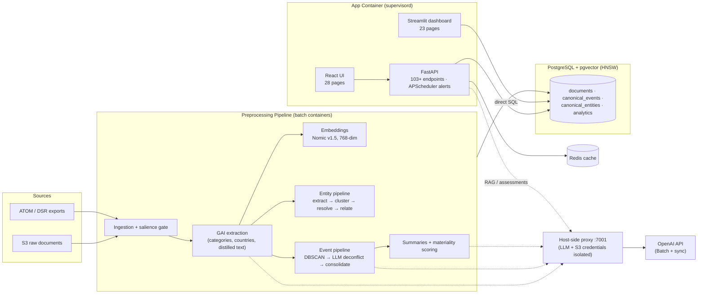

# Leveraging Generative AI for Soft Power Analytics at Scale

## A Technical White Paper on Automating International Relations Analysis

---

**Author:** Matt Morris, Data Scientist

**Version:** 6.1

**Date:** July 2026

---

## Table of Contents

1. [Executive Summary](#executive-summary)
2. [Introduction and Background](#introduction-and-background)
3. [Technical Approach](#technical-approach)
4. [Positioning Among Event-Data Systems](#positioning-among-event-data-systems)
5. [Model Evaluation and Performance](#model-evaluation-and-performance)
6. [System Architecture](#system-architecture)
7. [Prompt Engineering](#prompt-engineering)
8. [Event Processing Pipeline](#event-processing-pipeline)
9. [Entity and Relationship Extraction](#entity-and-relationship-extraction)
10. [Source Provenance and Bias Control](#source-provenance-and-bias-control)
11. [Agentic RAG System](#agentic-rag-system)
12. [Interactive Visualization](#interactive-visualization)
13. [Alerting and Notifications](#alerting-and-notifications)
14. [Competing Influence Analysis](#competing-influence-analysis)
15. [Research Projects](#research-projects)
16. [Report Generation and Export](#report-generation-and-export)
17. [Generated Insight Reports](#generated-insight-reports)
18. [Techniques and Lessons Learned](#techniques-and-lessons-learned)
19. [Alignment with Best Practices](#alignment-with-best-practices)
20. [Engineering Retrospective: Methodology Evolution and Operational Lessons](#engineering-retrospective-methodology-evolution-and-operational-lessons)
21. [Technology Stack Validation](#technology-stack-validation)
22. [Reproducibility and Determinism](#reproducibility-and-determinism)
23. [Knowledge Distillation](#knowledge-distillation)
24. [Deployment and Security Posture](#deployment-and-security-posture)
25. [Domain Transferability](#domain-transferability)
26. [Limitations and Future Directions](#limitations-and-future-directions)
27. [Conclusion](#conclusion)

---

## Executive Summary

This white paper presents a comprehensive framework for automating the analysis of soft power activities using Generative AI (GAI). The project aims to identify and categorize articles discussing soft power activities conducted by hard target countries towards Middle Eastern nations. Initially, a custom supervised topic model was planned, but advancements in generative AI models offered a more efficient solution.

Evaluations demonstrated that GAI models not only excelled in categorizing articles by soft power topics but also performed Named Entity Recognition (NER) tasks effectively. The decreasing costs of GAI made it the most timely and cost-effective approach for the project. With the more advanced capabilities offered by GAI, the project expanded its scope through innovative prompt engineering to not only categorize content, but also:

- Identify initiating and recipient countries of soft power interactions
- Extract specific project details including monetary values
- Determine geocoordinates for geographic visualization
- Track and consolidate events across large document corpora
- Generate automated summaries and insights
- **Extract entities and relationships** to build a network graph of actors involved in soft power transactions
- **Provide conversational access** to the data through an agentic RAG (Retrieval-Augmented Generation) interface
- **Visualize entity networks** through interactive graph visualizations
- **Alert analysts** to significant changes via configurable notification rules
- **Compare competing influence** across multiple countries in a single view
- **Support research workflows** with document collection and project-scoped analysis
- **Generate publication-ready reports** with Word document export
- **Control for media-source bias** through source-provenance classification and a corroborated-initiative metric (see [Source Provenance and Bias Control](#source-provenance-and-bias-control))
- **Produce analytic assessments** via an agentic investigation pipeline with adversarial verification of every finding, served in-app with interactive figures and click-through evidence tracing (see [Generated Insight Reports](#generated-insight-reports))

At current scale the platform manages ~765K documents spanning 23 months of coverage,
consolidated into ~11K canonical events and ~13.5K resolved entities with full
event-to-document traceability.

### The System at a Glance

| Dimension | Figure |
|-----------|--------|
| **Corpus** | ~765K documents · 23 months of coverage (from Aug 2024) |
| **Analytical scope** | 5 initiating powers · 4 instrument categories · 19-state MENA-centric recipient configuration |
| **Derived layers** | ~11K canonical events · ~13.5K resolved entities · full event→document traceability |
| **Retrieval** | 659K+ vector embeddings (768-dim, HNSW-indexed) + lexical hybrid search + cross-encoder reranking |
| **Classification quality** | GPT-4 category F1 0.865 (precision 0.94); distilled student contingency F1 0.81 |
| **Bias control** | Corroborated-initiative gate: ≥50% third-party coverage from ≥3 independent outlets |
| **Assessment rigor** | 57 generated findings adversarially verified; 0 refuted, 14 revised with corrections |
| **LLM economics** | 17 batch job types at 50% of synchronous pricing; quota-engineered concurrency; ~2% failure tail recovered without re-payment |
| **Application surface** | 103+ API endpoints · 28 React pages · 23 Streamlit pages · 22 schema migrations |
| **Deployment** | 9 packaging targets (cloud → hardened enterprise → laptop) · offline-capable inference · SBOM/provenance-attested images with zero fixable critical/high CVEs |
| **Disaster recovery** | Embedding restore in ~15–20 minutes vs. ~45-hour regeneration (~130× speedup) |

The black-box nature of GAI inference poses an ongoing risk that this project mitigates through periodic evaluations of GAI outputs to monitor performance, with exploration of training student models using GAI outputs as a contingency.

---

## Introduction and Background

### Project Origins

This project originated two and a half years ago as a follow-on to an earlier effort conducted during the COVID-19 pandemic. The initial project produced a product that mapped soft power investments by hard target countries toward Middle Eastern nations. While the outputs provided analysts with valuable insights into the reach of foreign influence activities, the process relied heavily on manual review and annotation. Analysts were responsible for categorizing articles, identifying the initiating and recipient countries, and labeling the relevant domains of soft power influence.

### The Case for Automation

This manual approach quickly revealed opportunities for automation. The repetitive and structured nature of categorization, country identification, and schema application made these tasks well-suited for natural language processing (NLP) techniques.

Initially, the plan was to employ traditional NLP methods and supervised training pipelines. The approach envisioned the development of a custom dataset through human annotation, followed by training a classification model to recognize soft power engagements according to a predefined schema. While this strategy was sound in principle, it carried significant costs and risks:

- The annotation process would have required thousands of labeled examples across multiple categories and subcategories
- The resulting model would likely need frequent retraining to adapt to evolving analytic requirements
- Time and resource investments would be substantial

### The Generative AI Pivot

At the time, ChatGPT-3.5 represented the state of the art in generative modeling. Early testing demonstrated strong potential but also revealed significant inconsistencies in outputs, along with high token costs that made scaling prohibitively expensive. This forced a critical decision point: whether to invest the project's limited resources in building annotated datasets and custom classifiers, or to accept the token costs and bet on future improvements in generative model performance.

Initial prompt engineering experiments proved decisive. With carefully structured instructions, ChatGPT-3.5 began closing the performance gap on fundamental tasks such as category classification and entity extraction. These early gains suggested that generative AI could outperform traditional NLP pipelines over the long term, particularly as newer models were released.

**The release of GPT-4 validated this decision.** Its dramatic increase in accuracy, consistency, and ability to follow complex prompt structures demonstrated that generative AI could meet the project's technical requirements far more effectively than traditional approaches.

### Defining Soft Power

Soft power is the ability of a country to shape the preferences and behaviors of other nations through appeal and attraction rather than coercion or payment. This influence is exerted through:

- Cultural diplomacy
- Values and policies
- Political ideals
- Educational exchanges
- Media and communications
- Economic partnerships

Soft power aims to build positive relationships and international cooperation by enhancing a country's reputation and credibility globally.

---

## Technical Approach

### Approach Philosophy

The project assessed the feasibility of using pretrained models through a phased evaluation:

1. **Zero-shot classification** and standard entity extraction models
2. **GAI models** such as GPT-3.5, GPT-4, Llama2, and Llama3
3. **Custom classification models** (contingency if other approaches proved insufficient)

### Comparative Analysis: Traditional ML vs. GAI

| Factor | Supervised/Trained ML Models | Prompt-Based GAI |
|--------|------------------------------|------------------|
| **Build Time** | 6+ months | 1 hour |
| **Build Cost** | $10,000s | $1s |
| **Run Cost** | $0 | $100s (decreasing quickly) |
| **Modification Agility** | Delayed, rigid | Immediate, flexible |
| **Performance** | Good for specific task | Excellent for many tasks |
| **Use Difficulty** | Data engineer/scientist required | Anyone who can type |

### GAI Capability Spectrum

The risk of inaccurate output and adverse effects of model bias increases as tasks move from factual to analytic:

**FACTUAL (Lower Risk):**
- Sentiment Tagging
- Thematic Categorization
- Quote Extraction

**MODERATE:**
- Salience Tagging
- Text Summary
- Event Tagging

**ANALYTIC (Higher Risk):**
- Findings Composition
- Prediction/Forecasting
- Intent Analysis

The Soft Power Project GAI prompts operate primarily in the factual to moderate range, focusing on categorization, extraction, and summarization tasks.

---

## Positioning Among Event-Data Systems

Automated extraction of political events from news media is an established research field,
and any new system should be read against its major incumbents. The most relevant
comparisons are **GDELT** (massive-scale automated event coding over global media),
**ICEWS** (curated CAMEO-coded dyadic events, historically used for crisis forecasting),
and **ACLED** (human-coded conflict events with high precision in a narrow domain).

| Dimension | GDELT | ICEWS | ACLED | This Platform |
|-----------|-------|-------|-------|---------------|
| **Coding method** | Pattern/parser-based automated coding | Automated coding with curation | Human coders | LLM schema application with LLM + human validation |
| **Ontology** | Fixed (CAMEO-derived) | Fixed (CAMEO) | Fixed (conflict taxonomy) | Custom soft-power schema, modifiable without retraining |
| **Unit of analysis** | Article-level event codes | Story-level deduplicated events | Curated incident records | Cross-article, multi-day **canonical events** with master/child hierarchy |
| **Deduplication** | Weak; duplication is a known artifact | Story-level | Human judgment | Two-stage embedding + LLM consolidation — a core design goal, not a post-hoc filter |
| **Media-bias handling** | Attention-based counts; bias acknowledged, not corrected | Limited | Source triangulation by coders | Measured provenance classification; corroborated-initiative gating |
| **Claim traceability** | To source URL | Restricted | To source list | Every metric and narrative claim resolves to source documents through the mention layer |
| **Entity layer** | Actor codes | Actor dictionary | Named actors | Resolved entity knowledge graph with typed relationships, linked to events |
| **Domain scope** | Global, all event types | Global, political events | Conflict | One region and topic, deeply — by design |

The design choices trace directly to known weaknesses of the incumbents. GDELT's
article-level coding makes volume a measure of *coverage*, not activity — the same
initiative announced, reported, and recapped counts many times; this platform's two-stage
canonical-event consolidation exists precisely to collapse that duplication before
counting. Fixed CAMEO-style ontologies cannot express instrument-of-influence distinctions
(a port concession, a scholarship program, and a joint exercise are all "cooperation");
the LLM-applied custom schema captures the categories analysts actually reason about, and
can evolve with requirements at prompt-edit cost rather than retraining cost. And where
event databases typically acknowledge media bias in documentation, this platform measures
it per relationship and gates its headline metric on independent corroboration.

Honest caveats run the other direction. The incumbents operate at global scale and
decades of depth; this platform covers one region over ~2 years, and its LLM coding costs
per document exceed parser-based approaches (mitigated by batch pricing and model
tiering). No formal cross-validation against GDELT/ICEWS event streams has yet been
performed — the integrated AidData ground-truth tables provide the current external
corroboration path, and a systematic overlap study remains future work (see
[Limitations](#limitations-and-future-directions)).

> **Best Practice Alignment**: Positioning against established datasets follows the
> research norm of situated contribution: the claim is not that the platform supersedes
> global event databases, but that LLM-era coding enables a different trade — custom
> ontology, consolidation-first counting, and measured bias correction — at regional scale.

---

## Model Evaluation and Performance

### Proof-of-Concept Testing

The Global Chinese Development & Finance (GCDF) dataset provided the first benchmark for evaluation. Although the dataset was limited—containing only positive samples and summarized descriptions rather than full articles—it offered a controlled testbed for measuring whether GAI models could correctly identify soft power activities and apply structured labeling schemas.

### Models Evaluated

Multiple models were tested, including:
- GPT-3.5
- GPT-4
- LLaMA-2 (70B and 8B)
- LLaMA-3 (8B and 70B)
- Facebook's BART Large MNLI (zero-shot classification baseline)

Each model was evaluated on:
- Identifying whether a text described a soft power event (salience)
- Classifying events into categories and subcategories
- Extracting initiating and recipient countries
- Maintaining output consistency with structured JSON prompts

### Performance Results

#### Salience Detection

| Model | Salience Rate | Assessment |
|-------|---------------|------------|
| GPT-4 | 20-30% | Most conservative and reliable |
| GPT-3.5 | ~56% | Tended toward over-inclusion |
| LLaMA models | Variable | Closer to GPT-3.5 in permissiveness |
| Zero-shot (MNLI) | Inconsistent | Often misapplied categories |

#### Categorization and Sub-Categorization

- **GPT-4** achieved an F1 score of **0.865** with high precision (0.94) in mapping texts to soft power categories
- GPT-4 successfully applied detailed schemas, including sector-specific subcategories, without retraining
- GPT-3.5 and LLaMA models performed moderately well but were more sensitive to prompt errors and less consistent with output formatting

#### Entity Extraction

- All models performed near-perfectly in identifying initiating and recipient countries
- Errors occurred primarily when source text used regional rather than country-level references
- Monetary values and project names were extracted with high accuracy when explicitly present in text

#### Format Compliance

- GPT-4 consistently adhered to structured output formats (JSON), critical for downstream post-processing
- GPT-3.5 and LLaMA models occasionally drifted, omitting required fields or introducing narrative text despite prompt constraints

### Human vs. Model Labeling

Two labeling exercises were conducted to test alignment between human annotators and GAI outputs:

**Round 1:** Three annotators collaboratively labeled 100 documents. Results diverged significantly from model labels, with humans adopting a narrower interpretation of soft power. Analysts later reviewing disagreements often sided with the models, suggesting annotators under-flagged relevant cases.

**Round 2:** A separate set of 200 documents was labeled independently by three annotators. Divergence persisted, confirming variability in human interpretation. Despite this, models captured nearly 100% of human-identified true positives, with disagreements concentrated in borderline or "grey area" cases.

> **Best Practice Alignment**: This iterative human-model comparison follows established ML evaluation practices: (1) multiple independent annotators to measure inter-rater reliability, (2) disagreement analysis to identify edge cases, and (3) expert adjudication of conflicts. The finding that humans exhibited higher variance than models is consistent with research on annotation quality in NLP tasks.

### Key Findings

- LLMs can reliably apply custom schemas without retraining
- GPT-4 outperformed other models in precision, consistency, and adherence to formatting
- Human annotators exhibited high variance in labeling, complicating efforts to establish definitive ground truth
- Analysts often judged model outputs as more accurate than first-pass human labels

---

## System Architecture

### High-Level Data Flow

```
DS&R Storage → Collections → GAI Salience & Extraction → Post-Processing →
Soft Power DB (pgvector) → Publication (Dashboard, Reports, Agent UI)
```

### System Topology



Solid lines are data flow; dotted lines are LLM calls routed through the credential-
isolating host proxy. The Streamlit dashboard's direct-database access (bypassing the
API contract) is a documented architectural trade-off discussed in the
[Engineering Retrospective](#engineering-retrospective-methodology-evolution-and-operational-lessons).

### Core Components

#### Data Layer
- **Document Metadata**: Source information and timestamps
- **GAI Extraction Data**: Structured outputs from analysis prompts
- **Embeddings**: Vector representations using Nomic Embed Text v1.5
  - Distilled Text Embeddings
  - Event Embeddings
  - Entity Embeddings

#### Processing Layer
- **Activity Aggregation**: Document and GAI extractions parsed and grouped
- **Unique Event & Project Identification**: Clustering and deduplication
- **Summary Generation**: GAI-powered summarization at multiple temporal scales

#### Output Layer
- **Soft Power Database**: PostgreSQL with pgvector extension
- **Analytics Dashboard**: Streamlit-based interactive visualization
- **Summary Publications**: Weekly/Monthly overviews distributed to community
- **Soft Power Agent UI**: Dynamic interactions with data via prompts

### Technology Stack

| Component | Technology |
|-----------|------------|
| Backend | SQLAlchemy 2.0, FastAPI |
| Database | PostgreSQL + pgvector |
| Frontend | React + TypeScript + Vite (primary), Streamlit (analytics) |
| AI/ML | OpenAI GPT models (gpt-4o, gpt-4o-mini, gpt-4.1), sentence-transformers |
| Clustering | DBSCAN with cosine distance |
| Infrastructure | Docker Compose, Alembic migrations, APScheduler |
| Storage | AWS S3, Redis (caching) |
| Embeddings | Nomic Embed Text v1.5 (open-source) |

*Note: for historical reasons the LLM API key is configured via the environment variable
`CLAUDE_KEY` — it is the OpenAI(-compatible) key used by all generative steps.*

---

## Prompt Engineering

### Verbose vs. Concise Prompts

**Concise prompts** tended to overgeneralize, particularly in salience detection. GPT-3.5 frequently labeled 50-60% of articles as soft power relevant when given short instructions.

**Verbose prompts**, which included detailed definitions of soft power, explicit schema rules, and examples of acceptable JSON outputs, significantly reduced false positives. GPT-4 in particular responded well to structured, multi-step instructions, demonstrating salience rates more in line with analyst expectations (20-30%).

### Structured Output Enforcement

Prompts that constrained models to return JSON outputs proved critical for pipeline integration. Including an explicit "ONLY output JSON" instruction and providing an example template greatly improved compliance across all models.

> **Best Practice Alignment**: Structured output enforcement follows the principle of "constrained decoding" recommended for production LLM systems. By providing explicit output schemas with examples, the system reduces parsing errors and enables reliable downstream processing—a core tenet of MLOps best practices.

### Expanded Task Capabilities

Beyond salience and categorization, prompt engineering enabled additional tasks:

| Task | Description |
|------|-------------|
| **Summarization** | Distilled text retaining only soft power-relevant content |
| **Geolocation** | Inferring latitude/longitude when explicit coordinates were missing (97.7% populated) |
| **Monetary Extraction** | Capturing announced funding amounts when stated in text (populated for ~25% of documents as free text; suitable for named-deal citation, not aggregation — see Limitations) |
| **Event Naming** | Creating descriptive titles for event-level tracking |

### Evolution with Newer Models

As newer models such as GPT-4o became available, instruction-following proved less of a bottleneck. The primary challenge shifted from writing detailed instructions to **context engineering**:

- **Context Window Management**: Efficiently chunking and distilling large corpora
- **Information Density**: Maximizing signal within constrained token budgets
- **Schema Alignment**: Designing context presentations that emphasized relationships

### Core Prompts

The system employs a series of specialized prompts:

1. **Salience Prompt**: Determines if text represents soft power activity
2. **Extraction Prompt**: Full categorization, entity extraction, and summarization
3. **Event Consolidation Prompt**: Groups related articles into unique events
4. **Unique Event Prompt**: Consolidates events across the corpus
5. **Event Update Prompt**: Identifies updates to existing events
6. **Final Event Summary Prompt**: Generates comprehensive event summaries
7. **Weekly/Monthly Summary Prompt**: Creates periodic analytical reports

---

## Event Processing Pipeline

The event processing pipeline uses a **two-stage batch consolidation architecture** that separates daily event detection from cross-temporal linking. This approach provides cleaner separation of concerns and enables LLM validation at multiple checkpoints.

### Architecture Overview

```
Stage 1: Daily Event Detection
├─ 1A: batch_cluster_events.py (DBSCAN clustering per day)
│      → event_clusters table
└─ 1B: llm_deconflict_clusters.py (LLM validation)
       → canonical_events + daily_event_mentions

Stage 2: Batch Consolidation (Across All Dates)
├─ 2A: consolidate_all_events.py (embedding similarity ≥0.85)
│      → Sets master_event_id hierarchy
├─ 2B: llm_deconflict_canonical_events.py (validates groups)
│      → Sets llm_validated=TRUE, picks best names
└─ 2C: merge_canonical_events.py (consolidates mentions)
       → Creates multi-day events, deletes children

Stage 3: Materiality Scoring
└─ score_canonical_event_materiality.py
   → Assigns material_score (1.0-10.0)
```

### Workflow Steps

#### Step 1: Salience Run
Document holdings are queried and run through GPT-4o-mini on ingest to detect articles relevant to the soft power project.

#### Step 2: Extraction Run
Salient articles are run through an extraction prompt using GPT-4o which:
- Categorizes articles according to the soft power schema
- Creates distilled versions containing only relevant content
- Identifies initiating and recipient countries
- Determines location (latitude-longitude)
- Extracts a `specific_event_name` for event tracking

#### Step 3: Daily Event Clustering (Stage 1A)
For each (country, date) combination:

1. Load all documents with `specific_event_name` or `event_name`
2. Generate embeddings using Sentence Transformers (Nomic Embed Text v1.5)
3. Run DBSCAN clustering with `eps=0.15` (cosine distance), `min_samples=1`
4. Calculate centroid embedding for each cluster
5. Organize clusters into batches of ~50-150 events for LLM processing
6. Save to `event_clusters` table with batch metadata

#### Step 4: LLM Cluster Deconfliction (Stage 1B)
For each event cluster:

1. Skip noise clusters (DBSCAN label -1) and single-name clusters
2. Submit multi-name clusters to LLM for validation:
   - Are these the same event at different lifecycle stages?
   - Should this cluster be split into separate events?
3. Create `canonical_events` records (one per unique event per day)
4. Create `daily_event_mentions` linking events to source documents via `doc_ids[]`
5. Uses SQLAlchemy savepoints for atomic creation of event + mentions

**Key Output:**
```python
class CanonicalEvent:
    canonical_name: str              # "Belt and Road Forum 2025"
    initiating_country: str          # "China"
    master_event_id: Optional[UUID]  # NULL = master, UUID = child
    embedding_vector: List[float]    # For similarity matching
    story_phase: str                 # "emerging"|"developing"|"peak"|"fading"|"dormant"
    material_score: Numeric(3,1)     # 1.0-10.0

class DailyEventMention:
    canonical_event_id: UUID
    mention_date: date
    article_count: int
    doc_ids: List[str]               # Source document traceability
```

#### Step 5: Cross-Temporal Consolidation (Stage 2A)
Groups canonical events across the entire dataset:

1. Load ALL canonical events for a country (no date filtering)
2. Compute pairwise cosine similarity on embedding vectors
3. Find connected components using similarity threshold ≥0.85
4. Select highest-article-count event as **master**
5. Set `master_event_id` on related events to create hierarchy

**Result:**
- Master events: `master_event_id IS NULL`
- Child events: `master_event_id = <master.id>`

#### Step 6: LLM Validation of Consolidation (Stage 2B)
For each event group (same `master_event_id`):

1. Submit group names to LLM:
   - "Are these the same real-world event?"
   - "Which canonical name is best?"
   - "Should this group be split?"
2. Update canonical names based on LLM selection
3. Set `llm_validated = TRUE` on validated master events
4. Supports checkpoint/resume for large-scale processing

#### Step 7: Daily Mention Merging (Stage 2C)
Consolidates `daily_event_mentions` from child to master events:

1. For each validated master event:
   - Merge article counts for same-date mentions
   - Reassign child mentions to master for different dates
   - Delete empty child canonical events
2. Update master event metadata:
   - `first_mention_date`, `last_mention_date`
   - `total_mention_days`, `total_articles`

**Result:** Master events now span multiple days with consolidated mentions and full document traceability.

#### Step 8: Materiality Scoring (Stage 3)
Assigns materiality scores (1.0-10.0) to events using ten granular anchors (the canonical
scale, used everywhere materiality appears in the platform):

| Score | Description | Dollar Threshold |
|-------|-------------|------------------|
| 1-2 | Routine diplomatic activity | < $1M |
| 3-4 | Notable but limited impact | $1M - $50M |
| 5-6 | Significant regional event | $50M - $500M |
| 7-8 | Major bilateral development | $500M - $5B |
| 9-10 | Strategic/transformative event | > $5B |

In production data the observed range is 2–9 with a mean near 4.7 — the granular anchors
prevent score clustering at the midpoint. The score is an LLM judgment of significance, not
a measured outcome, and each score is stored with its written justification.

#### Step 9: Summary Generation
Events filtered by country and run through GAI to build summaries with:
- Specific findings with source citations
- Hyperlinks to original documents via ATOM IDs
- Daily, weekly, and monthly summary generation

#### Step 10: Visualization
Dashboard enables dynamic manipulation of soft power data from country level down to individual articles.

#### Step 11: SME Review
Human intervention point where analysts can:
- Flag high-priority events for detailed tracking
- Split over-consolidated events
- Combine events that should be tracked together

> **Best Practice Alignment**: The SME Review step implements the "human-in-the-loop" (HITL) pattern recommended for high-stakes AI applications. Rather than fully automating decisions, the system presents AI outputs for expert validation, enabling correction of errors while building trust in automated processes.

### Database Schema

**`event_clusters`** - DBSCAN clustering results per day:
- `initiating_country`, `cluster_date`, `batch_number`
- `cluster_id`, `event_names[]`, `doc_ids[]`
- `centroid_embedding[]`, `representative_name`
- `processed`, `llm_deconflicted` flags

**`canonical_events`** - Deduplicated events with hierarchy:
- `canonical_name`, `initiating_country`, `master_event_id`
- `first_mention_date`, `last_mention_date`, `total_articles`
- `embedding_vector[]`, `story_phase`, `material_score`
- `llm_validated`, `llm_validated_at`

**`daily_event_mentions`** - Document-to-event linking:
- `canonical_event_id`, `mention_date`, `article_count`
- `doc_ids[]` (full traceability to source documents)
- Unique constraint: (canonical_event_id, mention_date)

### Why Two-Stage Architecture?

| Concern | Stage 1 (Daily) | Stage 2 (Batch) |
|---------|-----------------|-----------------|
| Context | Same-day events only | Full historical dataset |
| Focus | Deduplication within day | Temporal linking across days |
| LLM Validation | Cluster-level | Group-level |
| Traceability | doc_ids → event | Child → master hierarchy |

This separation ensures:
- Daily clustering has clear, bounded scope
- Batch consolidation benefits from complete dataset context
- Multiple LLM validation passes improve quality
- Full traceability from master events → daily mentions → source documents

---

## Entity and Relationship Extraction

Building on the foundational document categorization and event extraction capabilities, the system expanded to include comprehensive **entity and relationship extraction**. This enables the construction of a knowledge graph representing the actors, organizations, and connections underlying soft power activities.

The entity pipeline mirrors the event pipeline's **two-stage batch consolidation architecture**, separating daily entity detection from cross-temporal resolution.

### Architecture Overview

```
Stage 1: Daily Entity Detection
├─ 1A: extract_daily_entities.py (LLM extraction)
│      → raw_entities table
├─ 1B: cluster_daily_entities.py (DBSCAN clustering)
│      → entity_clusters table
└─ 1C: llm_deconflict_entity_clusters.py (LLM validation)
       → canonical_entities + daily_entity_mentions

Stage 2: Batch Consolidation (Across All Dates)
├─ 2A: consolidate_all_entities.py (embedding similarity ≥0.88)
│      → Sets master_entity_id hierarchy
├─ 2B: llm_deconflict_canonical_entities.py (validates groups)
│      → Sets llm_validated=TRUE, picks best names/roles
└─ 2C: merge_canonical_entities.py (consolidates mentions)
       → Creates multi-day entities, deletes children

Stage 3: Relationship Building
├─ 3A: link_entities_to_events.py (entity-event linking)
├─ 3B: build_entity_cooccurrence.py (co-occurrence graph)
├─ 3C: generate_entity_descriptions.py (LLM descriptions)
└─ 3D: classify_entity_relationships.py (relationship classification)
       → 9 typed relationships with descriptions
```

### Motivation

While event-level analysis provides insights into *what* happened, understanding *who* is involved and *how they interact* requires a deeper level of extraction. Entity and relationship extraction enables:

- **Network Analysis**: Identifying key actors and their influence patterns
- **Connection Discovery**: Finding hidden relationships between entities across documents
- **Temporal Tracking**: Monitoring how entity involvement evolves over time
- **Event Correlation**: Linking entities to specific soft power events

### Entity Taxonomy

The system extracts 5 core entity types with 14 role labels:

| Entity Type | Description | Examples |
|-------------|-------------|----------|
| **PERSON** | Individual officials, executives, diplomats | Wang Yi, Crown Prince Mohammed bin Salman |
| **ORGANIZATION** | Government agencies, NGOs, international bodies | Ministry of Foreign Affairs, UN, BRICS |
| **COMPANY** | Private and state-owned enterprises | Huawei, Saudi Aramco, China Development Bank |
| **LOCATION** | Cities, venues, facilities, projects | Gwadar Port, Cairo University |
| **OTHER** | Entities not fitting other categories | Specific agreements, treaties |

### Role Labels (14 Types)

Each entity is assigned a primary role from the `EntityRoleEnum`:

**Government/Diplomatic Roles:**
- `government_official`, `diplomat`, `military_official`

**Business Roles:**
- `business_leader`

**Cultural/Social Roles:**
- `cultural_figure`, `academic`, `media_figure`, `civil_society`

**Organizational Roles:**
- `implementing_organization`, `funding_organization`, `recipient_institution`

**Project/Location Roles:**
- `infrastructure_project`, `venue`, `other`

### Relationship Types (9 Types)

The system captures directed relationships between entities with LLM-classified types:

| Relationship Type | Description | Example |
|-------------------|-------------|---------|
| **works_with** | Colleagues at same level (person-person) | Wang Yi works_with Sergey Lavrov |
| **employed_by** | Person works for organization | Executive employed_by State Grid |
| **leads** | Person heads/directs organization | President leads Government |
| **represents** | Person acts as envoy/representative | Diplomat represents Ministry |
| **partnered_with** | Organizations in formal partnership | Company partnered_with SOE |
| **subsidiary_of** | Organization is part of parent | Division subsidiary_of Corporation |
| **located_in** | Organization/person based in location | Embassy located_in Capital |
| **visited** | Person traveled to location | Official visited Port |
| **signed_agreement_with** | Entities signed agreement together | Country signed_agreement_with Country |
| **co_occurrence** | Fallback when evidence insufficient | - |

### Extraction Pipeline (Stage 1)

#### Step 1A: LLM Entity Extraction
For each document with `salience_bool = true`:

1. Format prompt with document context (date, countries, categories)
2. Call GPT-4o-mini to extract entities by category:
   - PERSONS: Individual roles/titles, country affiliation, context
   - ORGANIZATIONS: Gov agencies, NGOs; type, country, function
   - COMPANIES: Businesses, SOEs; sector, country, involvement
   - LOCATIONS: Cities, venues, facilities; type, significance
3. Parse structured JSON output to `raw_entities` table
4. Store: `entity_name`, `entity_type`, `role`, `country_affiliation`, `context_snippet`

#### Step 1B: Daily Entity Clustering
For each (country, entity_type, date) combination:

1. Load raw entities with their names
2. Generate embeddings using Nomic Embed Text v1.5
3. Run DBSCAN clustering with `eps=0.12` (stricter than events), `min_samples=1`
4. Calculate centroid embedding per cluster
5. Organize into batches of ~150 entities for LLM processing
6. Save to `entity_clusters` table

#### Step 1C: LLM Cluster Deconfliction
For each entity cluster:

1. Skip noise clusters (DBSCAN label -1) and single-name clusters
2. Submit multi-name clusters to LLM:
   - Are these names the same entity (transliterations, abbreviations)?
   - What is the best canonical name?
   - What is the best primary role from valid roles?
3. Create `canonical_entities` with embeddings
4. Create `daily_entity_mentions` linking to source documents

**Key Output:**
```python
class CanonicalEntity:
    canonical_name: str              # "Wang Yi"
    entity_type: EntityTypeEnum      # PERSON
    primary_role: EntityRoleEnum     # government_official
    initiating_country: str          # "China"
    master_entity_id: Optional[UUID] # NULL = master, UUID = child
    alternative_names: List[str]     # ["Wang Yi", "Chinese Foreign Minister"]
    embedding_vector: List[float]    # For similarity matching
    entity_description: str          # LLM-generated summary
    key_activities: Dict             # Structured activity data

class DailyEntityMention:
    canonical_entity_id: UUID
    mention_date: date
    document_count: int
    doc_ids: List[str]               # Source document traceability
    associated_event_ids: List[str]  # Linked canonical events
```

### Consolidation Pipeline (Stage 2)

#### Step 2A: Cross-Temporal Consolidation
Groups canonical entities across the entire dataset:

1. Load ALL canonical entities for a country/entity_type (no date filtering)
2. Compute pairwise cosine similarity on embedding vectors
3. Find connected components using similarity threshold ≥0.88 (stricter than events)
4. **Constraint**: Only groups entities of SAME type
5. Select highest-document-count entity as master
6. Set `master_entity_id` on related entities

#### Step 2B: LLM Validation of Consolidation
For each entity group:

1. Submit group names to LLM with checkpoint/resume support:
   - "Are these the same real-world entity?"
   - "Which canonical name is best?"
   - "What is the best primary role?"
2. Update canonical names based on LLM selection
3. Set `llm_validated = TRUE` on master entities
4. Supports force mode for reprocessing

#### Step 2C: Daily Mention Merging
Consolidates `daily_entity_mentions` from child to master entities:

1. Merge JSONB dicts by summing counts
2. Merge arrays by deduplicating while preserving order
3. Delete empty child canonical entities
4. Update master entity statistics

### Relationship Building (Stage 3)

#### Step 3A: Entity-Event Linking
Links entities to canonical events:

1. Find events whose `daily_event_mentions` share `doc_ids` with entity mentions
2. Uses PostgreSQL array overlap operator (`&&`)
3. Populates `associated_event_ids[]` on daily mentions
4. Aggregates to `associated_events[]` on canonical entity

#### Step 3B: Co-occurrence Graph
Builds entity-entity relationships:

1. Create inverted index: doc_id → Set[entity_id]
2. For each document with 2+ entities: generate all pairs
3. Use sorted UUID ordering to avoid duplicates
4. Filter by minimum co-occurrence threshold (default: 2)
5. Create `entity_relationships` records

#### Step 3C: Entity Descriptions
Generates LLM descriptions for entities:

1. Gather context: metadata, activity metrics, document evidence, associated events
2. Call LLM to generate:
   - `entity_description`: 2-3 sentences with specific actions/counterparts
   - `key_activities`: primary_function, notable_actions, key_relationships, geographic_focus

#### Step 3D: Relationship Classification
Classifies generic co-occurrences into typed relationships:

1. Load document snippets for context (limit: 5 docs, 500 chars each)
2. Provide entity profiles (type, role, country)
3. Call LLM to classify relationship type and generate description
4. Update `relationship_type` and `relationship_description`

### Database Schema

**`raw_entities`** - Initial extraction per document:
- `doc_id` (FK), `entity_name`, `entity_type`, `role`
- `country_affiliation`, `context_snippet`

**`entity_clusters`** - DBSCAN clustering results:
- `initiating_country`, `cluster_date`, `entity_type`, `batch_number`
- `cluster_id`, `entity_names[]`, `doc_ids[]`
- `centroid_embedding[]`, `representative_name`
- `processed`, `llm_deconflicted` flags

**`canonical_entities`** - Deduplicated entities with hierarchy:
- `canonical_name`, `entity_type`, `primary_role`, `initiating_country`
- `master_entity_id` (self-referential FK for resolution)
- `alternative_names[]`, `country_affiliations[]`
- `first_mention_date`, `last_mention_date`, `total_documents`
- `embedding_vector[]`, `entity_description`, `key_activities`
- `primary_categories{}`, `primary_recipients{}`, `associated_events[]`
- `llm_validated`, `llm_validated_at`

**`daily_entity_mentions`** - Document-to-entity linking:
- `canonical_entity_id`, `mention_date`, `document_count`
- `doc_ids[]` (full traceability)
- `associated_event_ids[]` (event correlation)
- Unique constraint: (canonical_entity_id, mention_date)

**`entity_relationships`** - Entity-entity connections:
- `entity_from_id`, `entity_to_id` (FKs)
- `relationship_type` (9 types)
- `co_occurrence_count`, `first_co_occurrence`, `last_co_occurrence`
- `primary_categories{}`, `relationship_description`
- `source_doc_ids[]` (evidence)
- Check constraint: entity_from_id < entity_to_id (canonical ordering)

> **Best Practice Alignment**: Entity resolution follows knowledge graph construction best practices: two-stage consolidation mirrors event processing for consistency, canonical naming with alias tracking enables deduplication, multi-attribute matching prevents false merges, and idempotent database operations with check constraints ensure data integrity. The relationship classification with LLM validation improves on simple co-occurrence networks.

---

## Source Provenance and Bias Control

A corpus of media reporting is not a ledger of real-world activity — it is a record of
*attention*, and attention is unevenly supplied. The platform's single largest measured bias
is source composition: the ingested corpus over-indexes heavily on Iranian state media
(dozens of Iran-focused outlets; the highest-volume sources in the corpus are all Iranian
state organs). On raw document counts, Iran appears to dominate regional influence activity;
roughly four-fifths of that apparent footprint is Iran's own media describing Iran's own
activities. Left uncorrected, every cross-actor comparison in the platform would inherit
this artifact.

Rather than treating the bias as a caveat, the platform turns it into a **measured signal**
with a two-part methodology:

### Provenance Classification

Every document carries a `source_geofocus` attribute identifying the geographic focus of its
outlet. For any initiator→recipient relationship, each document is classified:

- **Self-reported** — the outlet belongs to the initiator's own media ecosystem
- **Third-party** — recipient-country or neutral outlets

The ratio of self-reported to third-party coverage is itself analytically meaningful: a
relationship carried overwhelmingly by the initiator's own media is a *narrative-projection*
signal (what the actor wants said), while third-party-carried coverage is a
*corroborated-traction* signal (what others independently observed). All cross-actor
magnitudes in the platform's analytical products are computed on the third-party basis, with
raw counts shown only as contrast.

One asymmetry must be stated honestly: the classification is only as good as corpus
composition. The current corpus contains many initiator-domestic outlets for Iran, few for
China, and none for Russia or Turkey — so the self-report ratio is a valid projection
measure only where domestic outlets are actually ingested. For the others, third-party
volume is simply the intensity measure. Expanding domestic-outlet coverage for all tracked
actors is a standing coverage priority.

### The Corroborated-Initiative Metric

Provenance classification composes with event consolidation to produce the platform's
honest unit of analysis: the **corroborated initiative** — a named canonical event gated at
≥50% third-party coverage from ≥3 independent outlets. Article counts measure attention;
gated initiative counts measure independently attested activity. In practice the gate is
transformative: the majority of one actor's extracted events fail it while roughly
two-thirds or more of its rivals' events pass, inverting naive volume rankings.

Derived analytics built on this method (per-relationship provenance intensity, the
initiative ledger with per-event corroboration shares, and source-provenance maps) are
materialized in a dedicated `analytics` schema, documented with migration-ready DDL, and
feed both the generated insight reports and candidate first-class app features.

> **Best Practice Alignment**: This implements the "measurement validity" principle for
> observational data: identify the generating process of the data (media attention),
> quantify its known biases, and construct estimators robust to them — rather than
> reporting raw counts whose face validity is illusory. Publishing both raw and corrected
> metrics side-by-side preserves auditability.

---

## Agentic RAG System

To enable dynamic, conversational access to the soft power data, the project developed an **Agentic RAG (Retrieval-Augmented Generation)** system. This system combines semantic search with structured analytics tools, allowing users to ask natural language questions and receive data-driven answers.

### Architecture Overview

The agentic system follows a three-step process:

```
User Query → Tool Selection (LLM) → Tool Execution → Response Generation (LLM)
```

**Step 1: Tool Selection**
- The LLM analyzes the user's query to determine which tools would be most helpful
- Returns a JSON array of tool names to invoke

**Step 2: Tool Execution**
- Selected tools are executed with appropriate parameters
- Results are aggregated from multiple tools when needed

**Step 3: Response Generation**
- Tool results are formatted as context for the LLM
- The LLM synthesizes a coherent, factual response
- Sources are tracked for attribution

> **Implementation note:** two generations of this capability coexist. The production chat
> path (the React "Research" page) uses the **layered RAG architecture** described later in
> this section — deterministic strategic-context lookup plus semantic event and document
> retrieval with entity-aware boosting. The seven-tool selection agent described immediately
> below is the earlier iteration, retained in the Streamlit dashboard and the experimental
> Agent workflow page.

### Available Tools

The agent has access to seven specialized tools:

| Tool | Purpose | Use Cases |
|------|---------|-----------|
| **search_events** | Semantic search across event summaries | "What events involve China and Egypt?" |
| **search_documents** | Search source documents | "Find detailed information about BRI projects in the Suez Canal Zone" |
| **get_country_stats** | Activity statistics for a country | "How active is Russia in Syria?" |
| **get_bilateral_summary** | Relationship summary between countries | "What is China's relationship with Egypt?" |
| **get_trending_events** | Currently trending events | "What are the latest soft power activities?" |
| **get_category_trends** | Category trend analysis | "How has economic cooperation evolved?" |
| **compare_countries** | Compare activity across countries | "Compare China and Russia's influence" |

### Query Engine

The RAG query engine provides semantic search capabilities using vector embeddings:

**Embedding Model:** `nomic-ai/nomic-embed-text-v1.5` (768-dimensional)

**Vector Stores:**
- `chunk_store` - Document chunk embeddings
- `summary_store` - Event summary embeddings
- `daily_store`, `weekly_store`, `monthly_store`, `yearly_store` - Period-specific stores

**Search Capabilities:**
- Similarity search with relevance scores
- Filtering by country, category, date range
- Deduplication of document results
- Hybrid search across events and documents

### Conversation Management

The agent maintains conversation history for context-aware responses:

```python
class SoftPowerAgent:
    def __init__(self):
        self.query_engine = QueryEngine()
        self.conversation_history = []
        self.tools = {
            'search_events': self._search_events,
            'search_documents': self._search_documents,
            # ... additional tools
        }
```

Each conversation turn records:
- User query with timestamp
- Assistant response with timestamp
- Sources used for the response

### System Prompt

The agent operates under a specialized system prompt that defines its role:

> You are an expert analyst specializing in soft power and international relations. You have access to a comprehensive database of soft power activities, including event summaries, source documents, bilateral relationship summaries, and activity statistics and trends.

Guidelines include:
- Always use tools to gather data before answering
- Combine multiple tool results for comprehensive answers
- Be specific with dates, countries, and categories
- Format responses clearly with sections and bullet points
- Include relevant metrics and statistics

### Analytics Tools

Beyond semantic search, the agent can invoke structured analytics:

**Country Activity Stats:**
```python
get_country_activity_stats(country, start_date, end_date)
# Returns: Events by type, top categories, top recipients
```

**Bilateral Relationship Summary:**
```python
get_bilateral_relationship_summary(initiating_country, recipient_country)
# Returns: Relationship metrics, key events, document counts
```

**Trending Events:**
```python
get_trending_events(country, period_type, limit, days)
# Returns: Events ranked by document count/recency
```

**Category Trends:**
```python
get_category_trends(category, country, date_range)
# Returns: Monthly activity, top events, trend direction
```

**Country Comparison:**
```python
compare_countries(countries, date_range)
# Returns: Comparative statistics across selected countries
```

### Layered RAG Context Architecture

A key enhancement to the RAG system is the **three-layer context injection** that provides richer, more accurate responses by combining multiple information sources:

```
User Query → Layer 1: Strategic Context (SQL) →
             Layer 2: Event Discovery (Semantic) →
             Layer 3: Document Chunks (Semantic) →
             LLM Response Generation
```

**Layer 1: Strategic Context (Deterministic SQL)**

Pre-analyzed strategic summaries retrieved via direct database lookup:
- **Bilateral Relationship Summaries**: Overview, key themes, trend analysis for country pairs
- **Country-Category Summaries**: Aggregated insights per influencer-category combination
- **Period Summaries**: Time-based analytical products

```python
def gather_strategic_context(influencer, recipient, category) -> str:
    # SQL lookup of BilateralRelationshipSummary
    # SQL lookup of CountryCategorySummary
    # SQL lookup of PeriodSummary
    return formatted_strategic_context
```

**Layer 2: Event Summary Discovery (Semantic Search)**

Semantic search across event summary embeddings:
- Daily, weekly, and monthly event collections
- Filtered by inferred or explicit country/category
- Returns top-k most relevant event summaries

**Layer 3: Document Chunk Search (Semantic Search)**

Traditional RAG retrieval over source documents:
- Chunked document embeddings in pgvector
- Entity-aware boosting for matched entities
- Deduplication to prevent redundant sources

**Benefits of Layered Context:**

| Layer | Source | Latency | Coverage |
|-------|--------|---------|----------|
| Strategic | SQL lookup | <50ms | Pre-analyzed summaries |
| Event | Semantic search | ~200ms | Consolidated events |
| Document | Semantic search | ~300ms | Raw source material |

This architecture ensures responses are grounded in both high-level analytical products and specific source evidence.

> **Best Practice Alignment**: The layered RAG architecture implements the "retrieval augmented generation" pattern with multi-source grounding. By combining deterministic lookups (strategic context) with semantic search (events and documents), the system balances response latency with comprehensiveness—a recommended pattern for enterprise RAG systems. Source attribution at each layer supports the "verifiable AI" principle.

---

## Interactive Visualization

The system provides two primary user interfaces for interacting with soft power data: a **conversational chat interface** and an **entity network visualization**.

> **Implementation note:** the React application is the primary UI (30+ pages including the
> Research chat, event/entity detail pages, competing-influence views, and the Insight Reports
> viewer described in [Generated Insight Reports](#generated-insight-reports)).
> The Streamlit-specific implementations described below (session-state filters, the pyvis
> network) remain available in the analytics dashboard.

### Chat with Data Interface

The "Chat with Data" page provides a conversational interface powered by the agentic RAG system.

**Features:**
- Real-time chat with conversation history
- Sidebar filters for date range, initiating country, and recipient countries
- Query context enhancement (filters automatically added to queries)
- Source attribution with expandable details
- Example queries to guide users

**User Experience:**
1. User enters a natural language question
2. Active filters are automatically included in the query context
3. Agent processes query using tools and semantic search
4. Response displayed with markdown formatting
5. Sources shown in expandable section with relevance scores

**Example Queries:**
- "What recent events involve China and Saudi Arabia?"
- "How has Iran's engagement with Iraq evolved?"
- "What is the relationship between China and Egypt?"
- "What cultural events has Turkey organized recently?"

**Filter Integration:**
```python
def build_filter_context():
    filters = st.session_state.filters
    context_parts = []

    if filters['start_date'] or filters['end_date']:
        context_parts.append(f"Date range: {filters['start_date']} to {filters['end_date']}")

    if filters['initiating_country']:
        context_parts.append(f"Initiating country: {filters['initiating_country']}")

    if filters['recipient_countries']:
        recipients = ", ".join(filters['recipient_countries'])
        context_parts.append(f"Recipient countries: {recipients}")

    return "ACTIVE FILTERS: " + "; ".join(context_parts)
```

### Entity Network Visualization

The "Entity Network" page provides an interactive graph visualization of entities and their relationships using **pyvis**.

**Visual Encoding:**
- **Node Size**: Based on mention count (more mentions = larger node)
- **Node Color**: Based on entity type (11 distinct colors)
- **Edge Width**: Based on observation count
- **Edge Color**: Based on relationship type
- **Arrow Direction**: Shows relationship direction (source → target)

**Entity Type Colors** (the five production entity types — see
[Entity and Relationship Extraction](#entity-and-relationship-extraction)):

| Entity Type | Color |
|-------------|-------|
| PERSON | Red |
| ORGANIZATION | Teal |
| COMPANY | Blue |
| LOCATION | Yellow |
| OTHER | Gray |

**Relationship Type Colors** (the nine production relationship types):

| Relationship Type | Color |
|-------------------|-------|
| works_with | Yellow |
| partnered_with | Teal |
| signed_agreement_with | Light Green |
| leads / employed_by / represents | Purple family |
| visited | Red |
| located_in | Orange |
| co_occurrence (fallback) | Gray |

**Interactive Features:**
- **Hover**: View entity/relationship details in tooltip
- **Click and Drag**: Reposition nodes
- **Scroll**: Zoom in/out
- **Click Node**: Highlight connected edges
- **Physics Toggle**: Enable/disable force-directed layout

**Sidebar Filters:**
- Country filter (multi-select)
- Entity type filter
- Relationship type filter
- Minimum mention threshold (slider)
- Maximum entities to display (slider)
- Graph height adjustment
- Physics and label toggles

**Metrics Dashboard:**
- Total entities displayed
- Total relationships displayed
- Average connections per entity
- Entity type diversity count

**Top Entities Table:**
Shows the top 10 most connected entities with:
- Entity name
- Entity type
- Country affiliation
- Mention count
- Connection count

**No fabricated data:**
The visualization renders only real extracted entities. When the entity tables are empty it shows pipeline instructions instead of demo content — the platform never displays fabricated entities, relationships, or values. (An earlier sample-data demo mode was removed for exactly this reason.)

### Technical Implementation

The network visualization is generated dynamically:

```python
def create_network_graph(entities, relationships, height_px, physics, show_labels):
    net = Network(
        height=f"{height_px}px",
        width="100%",
        bgcolor="#1E1E1E",
        font_color="white",
        directed=True
    )

    # Configure physics for force-directed layout
    net.set_options("""
    {
      "physics": {
        "enabled": true,
        "barnesHut": {
          "gravitationalConstant": -8000,
          "centralGravity": 0.3,
          "springLength": 150
        }
      }
    }
    """)

    # Add nodes with size/color based on entity attributes
    for entity in entities:
        size = 10 + (entity['mentions'] * 1.5)
        color = get_entity_color(entity['type'])
        net.add_node(entity['id'], label=entity['name'], size=size, color=color)

    # Add directed edges with tooltips
    for rel in relationships:
        width = 1 + (rel['count'] * 0.5)
        net.add_edge(rel['source'], rel['target'],
                     title=rel['type'], width=width,
                     arrows={'to': {'enabled': True}})

    return net.generate_html()
```

---

## Alerting and Notifications

The platform includes a comprehensive **alerting system** that enables analysts to receive proactive notifications when significant changes occur in the soft power landscape. This shifts the analyst workflow from reactive querying to proactive monitoring.

### Alert Condition Types

The system supports four types of configurable alert conditions:

| Condition Type | Description | Example Parameters |
|----------------|-------------|-------------------|
| **Materiality Spike** | Detects when materiality scores exceed baseline | `threshold_z: 2.0`, `window_days: 7`, `country: "China"` |
| **Volume Surge** | Alerts on unusual document volume | `threshold_z: 2.0`, `window_days: 7`, `country: "Russia"` |
| **New Entity** | Triggers when a new entity appears | `country: "China"`, `entity_type: "person"` |
| **New Event** | Alerts on new high-materiality events | `country: "Iran"`, `min_materiality: 3.0` |

### Notification Channels

Alerts can be delivered through multiple channels:

- **In-App (AlertBell)**: Visual notification indicator in the application header
- **Email**: Configurable email addresses for alert delivery
- **Slack**: Webhook integration for team notification channels

### Alert Severity Levels

| Severity | Use Case | Visual Indicator |
|----------|----------|------------------|
| **Info** | Routine changes worth noting | Blue |
| **Warning** | Significant changes requiring attention | Orange |
| **Critical** | Major developments requiring immediate review | Red |

### Alert Rule Configuration

Each alert rule specifies:

```python
class AlertRule:
    name: str                    # "China Military Activity Spike"
    condition_type: str          # "materiality_spike"
    condition_params: dict       # {"threshold_z": 2.0, "window_days": 7}
    channels: List[str]          # ["in_app", "slack"]
    channel_config: dict         # {"slack_webhook_url": "..."}
    severity: str                # "warning"
    cooldown_minutes: int        # 60 (prevent alert fatigue)
    is_enabled: bool             # True
```

### Background Evaluation

Alert rules are evaluated on a configurable schedule using **APScheduler**:

1. Background worker queries database for enabled rules
2. Each rule's condition is evaluated against current data
3. If triggered and cooldown has elapsed, alert is created
4. Notifications dispatched to configured channels
5. Alert history recorded for audit trail

### Alert History and Acknowledgment

All triggered alerts are stored in `AlertHistory` with:
- Timestamp and severity
- Title and detailed message
- Context data (what triggered the alert)
- Channels notified
- Acknowledgment status and timestamp

Analysts can acknowledge alerts to track review status and clear notification indicators.

> **Best Practice Alignment**: The alerting system follows observability and incident management best practices: configurable thresholds with statistical baselines (z-scores), multi-channel delivery, severity levels, cooldown periods to prevent alert fatigue, and acknowledgment tracking for audit trails. The use of APScheduler for background evaluation implements the "async job processing" pattern recommended for production systems.

---

## Competing Influence Analysis

A key analytical capability is the **Competing Influence Overlay**, which enables side-by-side comparison of multiple influencer countries' activities within a single recipient country.

### Purpose

Traditional analysis examines one influencer-recipient pair at a time. The Competing Influence view answers:
- How do China, Russia, Iran, Turkey, and the US compete for influence in Egypt?
- Which influencer dominates in which category?
- How have influence patterns shifted over time?

### Visualization Components

**1. Stacked Area Chart**

Shows document volume over time for all five influencers:
- X-axis: Time (monthly buckets)
- Y-axis: Document count
- Colors: Distinct color per influencer (China=red, Russia=blue, etc.)
- Interaction: Hover for exact values, click to filter

**2. Category Heatmap**

Matrix visualization showing activity intensity:

| Category | China | Iran | Russia | Turkey | US |
|----------|-------|------|--------|--------|-----|
| Economic | High | Low | Medium | Low | Medium |
| Military | Medium | Medium | High | Low | High |
| Social | High | Low | Low | Medium | Low |
| Diplomacy | High | Medium | High | Medium | High |

Cell color intensity based on document count, enabling quick pattern recognition.

**3. Per-Influencer Event Listing**

Expandable sections showing top events for each influencer:
- Event name and date range
- Document count and materiality score
- Category breakdown
- Click-through to event details

**4. RAG Comparative Assessment**

AI-generated analysis comparing influencer strategies:
- Streaming response generation
- Grounded in retrieved documents
- Source citations with relevance scores
- Exportable for reports

### Data Structure

```python
class CompetingInfluenceSummary:
    recipient: str                           # "Egypt"
    influencer_summary: List[InfluencerStats]  # Per-influencer metrics
    category_matrix: List[CategoryRow]        # Heatmap data
    monthly_trends: List[MonthlyData]         # Time series
    top_events: Dict[str, List[Event]]        # Events by influencer
```

### Recipient Countries

The Competing Influence view is available for all 18 recipient countries in the Middle East and North Africa region, with data filtered by the selected recipient.

---

## Research Projects

The **Research Projects** feature supports analyst workflows for collecting, organizing, and analyzing source documents across multiple queries.

### Motivation

Analysts often need to:
- Collect relevant documents across multiple search sessions
- Build a corpus for a specific research question
- Generate reports from curated sources only
- Share document collections with colleagues

Research Projects provide a structured way to accomplish these tasks.

### Project Workflow

```
Chat/Search → Find Relevant Document → Add to Project →
Repeat → Project-Scoped Analysis → Generate Report
```

**Step 1: Create Project**
- Name and description
- Status tracking (active/archived)
- User ownership

**Step 2: Collect Documents**
- From chat responses, click "Add to Project"
- From search results, select and add
- Metadata cached at collection time
- Source query recorded for context

**Step 3: Project-Scoped Chat**
- RAG queries restricted to project documents only
- Focused analysis without corpus noise
- Higher relevance for specific questions

**Step 4: Report Generation**
- Generate reports from project documents
- All citations from curated sources
- Export to Word document

### Database Schema

**`research_projects`** table:
```python
class ResearchProject:
    id: UUID
    user_id: UUID                # Owner
    name: str                    # "Iran Nuclear Analysis Q1 2026"
    description: Optional[str]
    status: ProjectStatus        # ACTIVE or ARCHIVED
    created_at: datetime
    updated_at: datetime
```

**`project_documents`** table:
```python
class ProjectDocument:
    id: UUID
    project_id: UUID             # Parent project
    doc_id: str                  # Reference to documents table
    # Cached metadata (snapshot at collection)
    title: str
    source_name: str
    date: date
    initiating_country: str
    recipient_country: str
    category: str
    excerpt: str
    # Context
    source_query: str            # Query that found this document
    notes: str                   # Analyst annotations
    added_at: datetime
```

### User Interface

**ProjectDrawer Component:**
- Side panel accessible from Research page
- List of user's projects with document counts
- Create new project
- View/manage project documents
- Delete or archive projects

**Document Collection:**
- "Add to Project" button on search results
- Project selector dropdown
- Optional notes field
- Confirmation feedback

> **Best Practice Alignment**: Research Projects implement the "progressive disclosure" UX pattern—analysts can use the system casually or invest in curated collections. The metadata caching at collection time follows the "snapshot isolation" pattern, ensuring project integrity even if source documents are later modified. Project-scoped RAG demonstrates the "context window management" best practice for focused analysis.

---

## Report Generation and Export

The platform provides comprehensive **report generation** capabilities for creating publication-ready documents with LLM-generated narratives, metrics, and citations.

### Report Types

**1. Country Reports**
- Single influencer country analysis
- Configurable date range
- All categories or filtered
- Top events and trends

**2. Bilateral Reports**
- Specific influencer-recipient pair
- Relationship summary and trajectory
- Key events and actors
- Category breakdown

**3. Thematic Reports**
- Category-focused (e.g., "Military Cooperation")
- Cross-country comparisons
- Trend analysis

### Report Sections

Reports are generated with configurable sections:

| Section | Content | Toggle |
|---------|---------|--------|
| **Executive Summary** | AI-generated overview | Always included |
| **Events** | Top events with descriptions | Configurable |
| **Entities** | Key actors and organizations | Configurable |
| **Metrics** | Document counts, materiality scores | Configurable |
| **Persons** | Notable individuals mentioned | Configurable |
| **Citations** | Source documents with hyperlinks | Always included |

### LLM Narrative Generation

Each report section uses specialized prompts:

```python
def generate_event_narrative(event_data, citations) -> str:
    prompt = f"""
    Generate a concise analytical narrative for this soft power event.
    
    Event: {event_data['name']}
    Date Range: {event_data['start']} to {event_data['end']}
    Category: {event_data['category']}
    Materiality: {event_data['materiality_score']}
    
    Source excerpts:
    {formatted_citations}
    
    Write 2-3 sentences describing the significance and key actors.
    Include citation numbers [1], [2] where appropriate.
    """
    return gai(system_prompt, prompt, model="gpt-4o")
```

### Citation Management

All claims are traced to source documents:

```python
def build_hyperlink(doc_id: str, display_text: str) -> str:
    # Generates clickable link to source document
    return f"[{display_text}](/document/{doc_id})"
```

Citations include:
- Document title and source
- Publication date
- Relevance score
- Direct link to full text

### Word Document Export

Reports can be exported to Microsoft Word format (.docx):

**Template-Based Generation:**
- Professional formatting with headers and styles
- Table of contents generation
- Embedded metrics tables
- Formatted citation lists
- Section breaks and page numbers

**Export Options:**
- Full report or selected sections
- With or without source excerpts
- Reviewer validation copy (includes confidence scores)

### Materiality Scoring Enhancement

Report generation uses the canonical 10-anchor materiality scale defined in the
[Event Processing Pipeline](#event-processing-pipeline) (Step 8). The granular anchors
prevent score clustering and provide better differentiation for report prioritization.

> **Best Practice Alignment**: Report generation follows document automation best practices: template-based formatting for consistency, section toggles for customization, and citation management with hyperlinks for verifiability. The granular materiality scoring with explicit anchors implements the "calibrated confidence" pattern, making AI-generated scores interpretable and actionable.

---

## Generated Insight Reports

The platform's most advanced capability — added in mid-2026 — moves generative AI from the
*factual/moderate* band of the capability spectrum into supervised *analytic* territory:
autonomously produced analytic assessments whose every finding passes
adversarial verification before publication.

> **Scope note:** these are AI-assisted analytical products generated from open-source
> media. They are not intelligence community products and do not claim IC tradecraft or
> review standards; the terminology throughout ("insight reports," "key findings") is
> deliberately chosen to reflect that distinction.

### The Product Set

Version-controlled markdown assessments with charts and per-figure audit data, covering the
theater from three angles:

| Product | Scope |
|---|---|
| **MENA Theater Assessment** | Cross-actor synthesis: influence market, contested terrain, initiative ledger, actor networks, temporal dynamics, early warning |
| **Initiator deep dives** (5) | China, Iran, Russia, Turkey, plus a relational U.S. assessment |
| **Category contests** (3) | Economic, Military, Social — cross-actor within one instrument |
| **Recipient cards** (17) | "Who courts X?" for each MENA state |

All magnitudes in these products use the provenance-corrected, initiative-grain metrics
described in [Source Provenance and Bias Control](#source-provenance-and-bias-control).

### The Agentic Investigation Pipeline

Reports are not generated in a single LLM pass over summary tables. An agentic harness runs
a **hypothesis-driven investigation** with direct read access to the raw data (SQL, vector
search, the entity graph):

```
1. Index & baseline     — scope the data; compute provenance normalization first
2. Parallel threads     — independent sub-investigations (influence signature,
                          competition, networks, temporal dynamics, initiative ledger),
                          each emitting candidate findings with evidence (queries,
                          event IDs, actual returned numbers)
3. Adversarial verify   — every finding is attacked by independent verifier agents
                          through two lenses: data integrity (re-run the query — do the
                          numbers reproduce? do the cited events exist?) and bias
                          artifact (could source composition alone produce this?)
4. Synthesis            — the report is assembled from surviving findings only, each
                          carrying a confidence tag; refuted findings are dropped and
                          revised findings carry corrected numbers
5. Completeness pass    — a final check for uninvestigated questions and thin threads
```

In the theater assessment production run, 57 findings entered verification; none were
refuted outright and 14 were revised with corrected numbers or added caveats — several of
the revisions caught genuine artifacts (e.g., a concentration ranking contaminated by
recipient-side media) that would otherwise have shipped.

### In-App Delivery with Evidence Tracing

The finished products are served inside the React application ("Insight Reports"), not as
static files:

- **Interactive figures.** Every report chart ships its underlying numbers as a sidecar CSV
  for auditability; the viewer hydrates these into interactive charts (tooltips, legends,
  a Chart/Figure/Data toggle) by sniffing the CSV's column signature. Chart shapes that
  can't be honestly reproduced interactively (heatmaps, maps, network graphs) remain as
  the original rendered figures.
- **Click-through evidence.** Initiative charts are drillable: clicking a named initiative
  traces it back through the event-consolidation chain to its canonical event and the
  source documents behind it — each document flagged self-reported vs third-party — with a
  deep link to the full event page. A report claim is thus never more than two clicks from
  its primary sources.
- **Filesystem-driven discovery.** New report products dropped into the repository appear
  in the application automatically; the reports are versioned artifacts that ship with
  releases.

> **Best Practice Alignment**: This capability operationalizes two safeguards the paper's
> risk framework has always required for analytic-band GAI use: *independent verification*
> (adversarial agents attempting to refute each finding before it ships) and *auditability*
> (persisted evidence, per-figure data, and click-through source tracing). It is the
> platform's fullest expression of the "verifiable AI" principle.

---

## Techniques and Lessons Learned

### Model Strategy & Cost Optimization

**Matched model to task:**
| Task | Model |
|------|-------|
| Salience filtering | GPT-4o-mini |
| Full extraction | GPT-4o |
| Deduplication, sourcing, clustering | GPT-4.1 |

**Open-source embeddings** (Nomic Embed Text v1.5 for retrieval, with a MiniLM cross-encoder reranker) significantly reduced token costs.

### Scalable High-Signal Artifacts

- Distilled texts into signal-only summaries for model efficiency
- Daily → Weekly → Monthly roll-ups provided scalable and traceable insights
- Used proxy identifiers to avoid token overflow from long UUIDs

### Output Structuring & Formatting

- Enforced JSON schemas for reliable machine-readable output
- Prompt precision mattered—quotation style, placeholder use (`<initiating_country>`)
- Embedding markdown metrics/charts in prompts boosted ranking task accuracy

### Sourcing & Claim Verification

- Split summarization from sourcing to improve citation fidelity
- Applied TF-IDF narrowing before model claim sourcing
- Deduplication consolidated events while preserving all underlying sources

### Context Window Management

- Preprocessing, chunking, clustering reduced raw reporting overload
- Deduplication avoided event inflation from redundant coverage
- Tiered summarization ensured detailed enrichment only for high-volume events

### Human-in-the-Loop & Governance

- Analysts validated high-stakes events and anomalies
- Risk controls prevented unchecked propagation of hallucinated content
- Selective validation combined with confidence metrics

---

## Alignment with Best Practices

The Soft Power Analytics platform was designed with deliberate attention to established best practices across AI/ML engineering, software architecture, and analyst workflow design. This section consolidates the key alignments.

### AI/ML Engineering Best Practices

| Practice | Implementation | Benefit |
|----------|----------------|---------|
| **Human-in-the-Loop (HITL)** | SME review step for event consolidation, alert acknowledgment, entity verification | Catches AI errors while building analyst trust |
| **Model Tiering** | GPT-4o-mini for salience, GPT-4o for extraction, GPT-4.1 for complex reasoning | Optimizes cost/performance tradeoff |
| **Structured Output Enforcement** | JSON schema constraints with examples in prompts | Reliable parsing, reduced post-processing errors |
| **Iterative Prompt Refinement** | Verbose prompts with explicit instructions evolved through testing | Consistent, predictable model behavior |
| **Knowledge Distillation** | DistilBERT evaluated on GPT-4o labels (contingency option) | Potential for reduced costs if API becomes prohibitive |
| **Evaluation with Human Baselines** | Multi-annotator labeling exercises with disagreement analysis | Realistic performance assessment |

### RAG System Best Practices

| Practice | Implementation | Benefit |
|----------|----------------|---------|
| **Multi-Source Grounding** | Three-layer context (strategic, event, document) | Comprehensive, verifiable responses |
| **Source Attribution** | Citation numbers with hyperlinks to source documents | Analyst verification, audit trail |
| **Semantic + Deterministic Retrieval** | Vector search combined with SQL lookups | Speed and accuracy balance |
| **Context Window Management** | Distilled text summaries, chunking strategies | Efficient token usage |
| **Entity-Aware Search** | Boost documents mentioning matched entities | Improved relevance for actor-focused queries |

### Software Architecture Best Practices

| Practice | Implementation | Benefit |
|----------|----------------|---------|
| **Separation of Concerns** | Distinct services for pipeline, chat, dashboard, API | Maintainability, independent scaling |
| **Idempotent Operations** | `ON CONFLICT DO NOTHING`, incremental processing | Safe re-runs, crash recovery |
| **Database Normalization** | Separate tables for entities, relationships, documents | Data integrity, query flexibility |
| **Event Sourcing** | Audit tables for extraction runs, alert history | Debugging, compliance |
| **Configuration Management** | YAML config with environment variable overrides | Environment flexibility |

### Data Quality Best Practices

| Practice | Implementation | Benefit |
|----------|----------------|---------|
| **Validation at Extraction** | Entity type, role, and relationship type validation against taxonomies | Consistent data quality |
| **Deduplication Strategy** | Canonical names with aliases, multi-attribute matching | Clean entity graph |
| **Temporal Tracking** | First/last seen dates, observation counts | Trend analysis capability |
| **Confidence Scoring** | Extraction confidence, relationship observation counts | Prioritization signals |

### Analyst Workflow Best Practices

| Practice | Implementation | Benefit |
|----------|----------------|---------|
| **Progressive Disclosure** | Simple search → detailed analysis → curated projects | Supports varied skill levels |
| **Filter Context Preservation** | Sidebar filters automatically included in RAG queries | Consistent analysis scope |
| **Proactive Notifications** | Configurable alerts with cooldowns | Reduces information overload |
| **Export to Familiar Formats** | Word document generation with professional formatting | Integration with existing workflows |
| **Source Traceability** | All claims linked to documents via citation hyperlinks | Verification support |

### Governance and Risk Best Practices

| Practice | Implementation | Benefit |
|----------|----------------|---------|
| **Risk Management Framework** | Documented risks with mitigation strategies | Informed decision-making |
| **Black-Box Mitigation** | Periodic evaluation, student model contingency | Reduced vendor dependency |
| **Audit Trails** | Extraction runs, alert history, project documents | Compliance, debugging |
| **Graceful Degradation** | Fallback behaviors when LLM unavailable | System reliability |
| **Role-Based Access** | JWT authentication, user-scoped projects | Data security |

### Visualization Best Practices

| Practice | Implementation | Benefit |
|----------|----------------|---------|
| **Visual Encoding Standards** | Consistent colors for entity types, relationship types | Quick pattern recognition |
| **Interactive Exploration** | Hover tooltips, click-to-filter, zoom/pan | Analyst-driven discovery |
| **Metrics Dashboards** | Key counts and averages prominently displayed | Quick orientation |
| **No Fabricated Data** | Empty states show pipeline guidance, never demo content | Analyst trust — nothing artificial can be mistaken for analysis |

### Alignment Summary

The platform demonstrates adherence to best practices across the full stack:

```
┌─────────────────────────────────────────────────────────────────┐
│                     BEST PRACTICE COVERAGE                       │
├─────────────────────────────────────────────────────────────────┤
│  AI/ML          │ HITL, tiering, distillation, evaluation       │
│  RAG            │ Multi-source, attribution, semantic+SQL       │
│  Architecture   │ Separation, idempotency, normalization        │
│  Data Quality   │ Validation, deduplication, confidence         │
│  Analyst UX     │ Progressive disclosure, traceability          │
│  Governance     │ Risk framework, audit trails, access control  │
│  Visualization  │ Encoding standards, interactivity             │
└─────────────────────────────────────────────────────────────────┘
```

These alignments were not coincidental—they emerged from iterative development with continuous attention to maintainability, scalability, and analyst trust. The result is a system that delivers AI-powered insights while remaining transparent, verifiable, and adaptable to evolving requirements.

---

## Engineering Retrospective: Methodology Evolution and Operational Lessons

Most technical white papers describe a system as it stands. This section describes how it
*got here* — reconstructed from the project's development history (database migration
records, release logs, incident runbooks, and internal assessments). For an R&D audience,
the evolution is often more instructive than the destination: it shows which bets paid off,
which assumptions failed, and what it actually costs to keep an AI analytics platform
trustworthy over time.

### The Schema as a Methodology Ledger

Database migrations are the most durable record of how a project's thinking evolved — each
one is a dated, irreversible commitment to a new analytical capability. The platform's 22
Alembic migrations trace a clear arc:

| Period | Migration Evidence | What It Marks |
|--------|-------------------|---------------|
| Dec 2024 | `add_entity_tables` | Entity tracking begins — earlier than often assumed; entities were foundational, not a late add-on |
| Early 2025 | Initial canonical-events schema with `material_score` | **Materiality scoring was present from the first schema layer**, not retrofitted |
| Feb 2025 | `add_batch_jobs_table` | OpenAI Batch API adoption — the cost-engineering inflection point |
| Late 2025 | Bilateral, category, and canonical-materiality summary tables | The strategic summary layer (later Layer 1 of the RAG architecture) |
| Dec 2025 | `add_llm_validated_checkpoint` | Checkpoint/resume fields on canonical events — hardening LLM validation for large, interruptible batch runs |
| Jan 2026 | Full entity-resolution schema (449-line migration, the project's largest) | The two-stage entity knowledge graph: raw → clusters → canonical → mentions → relationships |
| Feb 2026 | `add_users_table`, `add_aiddata_tables` | Authentication arrives; **external ground-truth data (AidData)** ingested for corroborating extracted financial claims |
| Mar 2026 | `add_search_vector` + a genuine branch-merge migration | Hybrid lexical+vector search; evidence of **parallel development streams** reconciled via Alembic branch merge |
| Apr 2026 | Alert tables, research-project tables, enterprise JWT, HNSW index, `specific_event_name` — five migrations in two days | The analyst-workflow feature wave, plus retrieval-performance work (HNSW over 659K vectors) |
| May 2026 | Agent session/workflow tables | The agentic layer becomes stateful and auditable |
| Jun 2026 | `add_ingestion_jobs_table` | Self-service, UI-driven ingestion; the schema stabilizes |

The arc reads: **events → materiality → entities → external validation → search → analyst
workflows → agents → self-service.** Each layer built on validated foundations from the
previous one — capability was added in the order an analyst's trust required, not the order
that was easiest to build.

### Methodology Pivots — What Changed and Why

Beyond the founding pivot (supervised ML → generative AI), the development record shows at
least six deliberate mid-course corrections:

| Pivot | From → To | Driver |
|-------|-----------|--------|
| Event identity | Ad-hoc chunk-level SPIDs → canonical events with master/child hierarchy | Traceability and multi-day event tracking |
| Clustering | HDBSCAN → DBSCAN with explicit `eps` | Reproducibility — an explicit distance threshold beats a self-tuning one when results must be explainable |
| Embeddings | MiniLM-L6-v2 (384-dim) → Nomic Embed Text v1.5 (768-dim) | Retrieval quality; MiniLM survives as the cross-encoder reranker |
| Entity taxonomy | 11 types / 25 roles / 30 topics → 5 types / 14 roles / 9 relationships | **Extraction reliability** — a richer taxonomy produced less consistent LLM labels than a simpler one; the schema was consolidated during implementation |
| Agent paradigm | Tool-selection agent → conversational assistant with doctrine-scoped data tools | Analyst usability; freeform tool orchestration was less predictable than a curated toolset |
| Cross-actor measurement | Raw article counts → provenance-corrected corroborated initiatives | The corpus-composition bias documented in [Source Provenance and Bias Control](#source-provenance-and-bias-control); rolled out incrementally as vertical "slices" across every dashboard |

The taxonomy consolidation deserves emphasis for R&D readers: it is a counter-intuitive
result that **reducing** schema expressiveness **improved** data quality. LLM extraction
reliability degrades as label sets grow; the production schema settled at the granularity
the models could apply consistently, not the granularity analysts could imagine using.

### Case Study: The Silent Embedding Regression

The most instructive incident in the project's history was not a crash — it was a system
that kept running while silently producing garbage.

**What happened.** A routine dependency upgrade (transformers 5.x / sentence-transformers
5.x) changed how the Nomic embedding model loaded: incompatible weight keys were silently
skipped and **randomly initialized weights were used instead**. No error was raised. The
pipeline continued to run end-to-end, embeddings were generated and stored, and every
downstream layer — document retrieval, event clusters, canonical events, entity clusters,
and the summaries built on top of them — was constructed on noise. Retrieval returned
near-random results.

**Why it matters.** In a derived-data architecture, the embedding layer is an *epistemic
dependency* of everything above it. A silent failure there does not degrade the system — it
invalidates it, while all health checks stay green. Traditional monitoring (uptime, error
rates, throughput) is structurally blind to this failure class.

**The recovery**, distilled into a repeatable enterprise cutover runbook:

1. **Pin and verify**: dependency ceilings (`transformers<5`, `sentence-transformers<4`)
   plus corrected task prefixes, with the rationale documented inline in the Dockerfile
2. **Build-time model self-consistency gate**: every image build asserts that two
   independent loads of the embedding model produce identical vectors
   (`cos(load1, load2) = 1.000`) and that all weight keys matched — a deterministic tripwire
   for the exact silent-failure mode encountered
3. **Wipe-and-rebuild tooling as a first-class operation**: dedicated scripts clear only
   the embedding-derived layers (clusters, canonical events/entities, mentions, summaries)
   while preserving source documents and raw extractions — with `--dry-run` previews
4. **A post-rebuild validation battery** (`validate_rebuild.py`) gating the cutover on zero
   failures, plus a live retrieval spot-check with a minimum similarity threshold
5. **Resumable, idempotent orchestration**: the multi-day rebuild can be interrupted and
   re-run with the same command; preparation only fills gaps, and results already completed
   on the provider's side are re-pulled without re-paying

**Generalizable lessons** (each now encoded as a control, not a memory):

| Symptom | Root Cause | Standing Control |
|---------|-----------|------------------|
| Retrieval returns garbage, no errors | Silent random-weight model load | Build-time cosine self-consistency assertion |
| Batch retries fail with "file not found" | Ephemeral container scratchpad | Named persistent volume for batch artifacts |
| Valid batches cancelled as "stalled" | Local timeout shorter than provider latency | Stall-timeout disabled by default for Batch API |
| HTTP 429 batch failures | Exceeded provider's enqueued-token quota | Concurrency sized as `floor(queue_limit / tokens_per_batch)` |
| Paying twice for completed work | Lost output files | Recovery tool re-pulls completed results from the provider |

> **Best Practice Alignment**: This incident and response illustrate "data downtime"
> engineering for ML systems: semantic correctness must be asserted, not assumed, because
> the failure modes that matter most produce no exceptions. The build-time model gate is an
> example of shifting validation left — catching an inference-integrity failure at image
> build rather than in analyst-facing results.

### Release Engineering and Supply-Chain Discipline

The recent development record shows the platform operating on a genuine release cadence —
twelve tagged releases in roughly three weeks during the enterprise-hardening push — with
supply-chain controls uncommon at this project scale:

- **Digest-pinned base images, refreshed per release**: recurring "refresh base digest
  pins" commits show pins re-resolved at every release rather than set once and forgotten
- **SBOM and provenance (mode=max) attestations** on every pushed image
- **Source-level supply-chain defense**: the custom pgvector image pins the upstream *git
  commit SHA* and verifies it after clone — defending against tag-moving attacks, not just
  registry tampering
- **Measured CVE reduction as a program, not an event**: the application image went from
  95 CVEs (2 critical, 5 high) to 34 (all low/no-fix-available, zero critical/high) — a 64%
  reduction — via base upgrades, build-toolchain removal after compilation, migrating
  supervisor from a Debian package to pip (clearing an entire dependency chain), and
  removing individually CVE-flagged binaries. The database image replaced an unmaintained
  community image carrying 337 CVEs with a hardened source build carrying 51 (85%
  reduction), all inherited from the official Postgres base
- **A documented residual-risk posture**: remaining CVEs are enumerated with
  exploitability analysis in deployment context, and an enterprise exception-request
  template exists for accreditation workflows

### Deployment as a Portfolio, Not a Path

Nine Docker Compose targets now exist — demo, dev (hot-reload), production, enterprise,
laptop (CPU / GPU / embed variants), Windows, and preprocessing — evidence that the same
codebase is deliberately packaged for radically different environments: cloud development,
a hardened enterprise daemon, and an analyst's laptop.

The enterprise path is the most instructive. Hardened daemons in restricted environments
forbid operations most deployment guides assume: no `docker exec`, no `docker cp`, no
container removal, no bridge networks. The project's response was a capability matrix of
what the hardened daemon permits, and a ~1,400-line raw-Docker deployment script built
entirely within those constraints — host networking, idempotent start-or-run launches,
database administration via host-native `psql` over TCP rather than container exec, an
automatic pre-rebuild safety dump, and a credential-drift guard that detects when the
environment file has diverged from an already-initialized database volume.

Two design choices stand out for restricted-connectivity deployments:

- **Offline-first inference**: embedding and reranker models are baked into the image at
  build time, with offline flags set at runtime — zero model-hub egress in production, and
  images transferable into enclaves as `.tar` files
- **Credential isolation via a host-side proxy**: LLM and object-store credentials can
  live entirely outside the application container, which calls back through a loopback
  proxy; the gateway JWT is propagated per-request so LLM calls execute under the *user's*
  authority rather than a shared service credential

### Batch Economics at Scale

The pipeline's LLM workload runs predominantly through the OpenAI Batch API — 17 job types
covering extraction, deconfliction, scoring, and summary generation — at 50% of synchronous
token pricing with roughly 10× throughput. The operational learning is that batch
processing at scale is a *quota-engineering* problem: safe concurrency is computed from the
provider's enqueued-token quota divided by measured tokens-per-batch (~0.43M for the
heaviest job type), a pre-submission cost estimator prices every JSONL file before it is
sent, and the full job lifecycle (estimated vs. actual cost, retries, file IDs, progress)
is tracked in a dedicated database table. A ~2% scattered batch-failure tail proved normal
at scale; the pipeline treats tail recovery as routine — completed results are re-pulled
from the provider without re-payment, and re-running the orchestrator fills only the gaps.

### Analytic Integrity as an Engineering Practice

A cluster of recent changes shows integrity being enforced in code rather than policy —
small individually, but jointly a distinctive discipline:

- **Data-coverage awareness**: "recent" in analyst-facing views and agent responses is
  anchored to the corpus's actual latest-data date, not the wall clock — preventing the
  quiet illusion that the system is more current than its data
- **No fabricated placeholders**: a demonstration mode that displayed realistic-looking
  sample entities when the database was empty was deliberately removed — in an analytic
  system, plausible synthetic data is a liability, not a convenience
- **Fail loudly, not silently**: agent tools were changed to reject unknown or ambiguous
  entity references outright rather than silently matching nothing and returning an
  empty-but-plausible answer
- **Terminology discipline**: product language was audited to describe outputs as
  analytic insight rather than implying the authority of finished intelligence

> **Best Practice Alignment**: These are instances of "epistemic hygiene" — aligning what
> the system *appears* to know with what it *actually* knows. They cost little to implement
> and are among the highest-leverage trust investments an analytic platform can make.

### Sustainment: An Honest Self-Assessment

Ahead of a planned maintainer transition, the project commissioned an internal
maintainability assessment — and published its unflattering findings alongside its
strengths. Handoff readiness was scored ~60/100. Documented weaknesses included a ~6,000-line
API "god file" holding ~98 endpoints (router extraction now underway), automated test
coverage near 4% with non-blocking CI checks, and a dual-frontend maintenance burden (React
product UI and a 23-page Streamlit dashboard with direct database access) flagged as a
strategic decision to make rather than an ambiguity to inherit. The assessment produced a
phased remediation roadmap (demo-hardening → de-bloating → modularization → handoff
hardening), several phases of which are already complete: a 34 MB legacy archive was removed
from the working tree, five overlapping deployment documents were consolidated behind a
single decision tree, and the production database was made external-capable (native
Postgres with pgvector) so the custom database container is now a dev/demo convenience
rather than a production dependency.

For R&D sponsors, the meta-lesson is the practice itself: a system intended to outlive its
original developer needs its technical debt *measured and scheduled*, not discovered at
handoff. The assessment's candor — including publishing a below-target readiness score — is
what makes its roadmap credible.

---

## Technology Stack Validation

This section validates claimed capabilities against actual implementation status, providing transparency about what has been built, what is partially implemented, and what remains planned.

### Implementation Status Summary

| Technology | Status | Location | Notes |
|-----------|--------|----------|-------|
| **pgvector** | ✅ FULL | `services/pipeline/embeddings/` | LangChain PGVector integration; HNSW index on the embedding store |
| **APScheduler** | ✅ FULL | `server/alert_evaluator.py` | 5-minute evaluation cycle for alerts |
| **DBSCAN Clustering** | ✅ FULL | `services/pipeline/events/`, `services/pipeline/entities/` | eps=0.12-0.15, cosine distance |
| **GPT-4/GPT-4o** | ✅ FULL | `server/`, `services/pipeline/` | gpt-4o-mini, gpt-4o, gpt-4.1 via OpenAI SDK |
| **Sentence Transformers** | ✅ FULL | `services/pipeline/embeddings/` | Nomic Embed Text v1.5 (entities/events) |
| **React Frontend** | ✅ FULL | `client/src/pages/` | 30+ pages, React 19.2, TypeScript, Vite |
| **Streamlit Dashboard** | ✅ FULL | `services/dashboard/pages/` | 23 pages, analytics UI |
| **FastAPI** | ✅ FULL | `server/main.py` + `server/routers/` | 100+ endpoints (router extraction in progress), Redis caching |
| **Insight Reports Viewer** | ✅ FULL | `server/routers/intel_reports.py`, `client/src/pages/IntelReport*` | Filesystem-driven report discovery, CSV-hydrated interactive charts, evidence drill-down |
| **Provenance Analytics** | ✅ FULL | `analytics` schema, `docs/reports/_derived/` | Provenance intensity, initiative ledger, changepoints, blocs, themes |
| **Word Document Export** | ✅ FULL | `server/report_exporter.py` | python-docx, template-based |
| **Research Projects** | ✅ FULL | `shared/models/research_project_models.py` | User-scoped document collections |
| **Alerting System** | ✅ FULL | `shared/models/alert_models.py`, `server/alert_evaluator.py` | 4 condition types, multi-channel |
| **Competing Influence** | ✅ FULL | `server/main.py`, `client/src/pages/CompetingInfluencePage.tsx` | Multi-influencer comparison |
| **Entity Network** | ✅ FULL | `services/dashboard/pages/17_Entity_Network.py` | pyvis force-directed graph |
| **HDBSCAN** | ⚠️ ARCHIVED | `_archive/` only | DBSCAN used in production |
| **Knowledge Distillation** | ⚠️ EVALUATED | N/A (see below) | DistilBERT evaluated, not deployed |

### Detailed Validation by Component

#### AI/ML Components

| Claimed | Actual Implementation | Evidence |
|---------|----------------------|----------|
| GPT-4o for extraction | ✅ Implemented | `server/main.py`: model parameter defaults |
| GPT-4o-mini for salience | ✅ Implemented | `services/pipeline/batch/utils/cost_estimator.py` |
| Sentence Transformers | ✅ Implemented | **Nomic Embed Text v1.5** for retrieval; MiniLM cross-encoder as reranker (earlier versions of this paper mis-cited MiniLM-L6-v2 as the retrieval model — corrected as of v4.0/v5.0) |
| HDBSCAN clustering | ⚠️ Not in production | DBSCAN used; HDBSCAN only in `_archive/` |
| DistilBERT distillation | ⚠️ Evaluated only | F1=0.81 reported; no deployed model found |

#### Database & Storage

| Claimed | Actual Implementation | Evidence |
|---------|----------------------|----------|
| PostgreSQL + pgvector | ✅ Implemented | `requirements.txt`: pgvector>=0.2.5 |
| HNSW indices | ✅ Implemented | Migration `20260403_add_hnsw_index`: `vector(768)` column typed to model output, HNSW index (m=16, ef_construction=64, cosine) over 659K+ embeddings — replaced sequential scans with sub-linear ANN search |
| SQLAlchemy 2.0 | ✅ Implemented | `shared/database/database.py` |
| AWS S3 | ✅ Implemented | `services/pipeline/embeddings/s3.py` |
| Redis caching | ✅ Implemented | `server/main.py`: Redis-based response caching |

#### Frontend Components

| Claimed | Actual Implementation | Evidence |
|---------|----------------------|----------|
| React + TypeScript | ✅ Implemented | 28 pages in `client/src/pages/` |
| Streamlit dashboard | ✅ Implemented | 23 pages in `services/dashboard/pages/` |
| Entity Network viz | ✅ Implemented | pyvis-based force-directed graph |
| Recharts | ✅ Implemented | Used in React frontend |
| Chat interface | ✅ Implemented | `ChatPage.tsx`, RAG integration |

#### Processing Pipeline

| Claimed | Actual Implementation | Evidence |
|---------|----------------------|----------|
| Two-stage event pipeline | ✅ Implemented | `batch_cluster_events.py`, `consolidate_all_events.py` |
| Canonical events | ✅ Implemented | `CanonicalEvent` model, master_event_id hierarchy |
| LLM deconfliction | ✅ Implemented | `llm_deconflict_clusters.py`, `llm_deconflict_canonical_events.py` |
| Entity extraction | ✅ Implemented | Full two-stage pipeline in `services/pipeline/entities/` |
| Relationship classification | ✅ Implemented | 9 typed relationships, LLM classification |

### Capability by Workflow Location

| Capability | Preprocessing | API/Backend | React UI | Streamlit | Status |
|------------|---------------|-------------|----------|-----------|--------|
| Document Ingestion | ✅ | - | - | - | FULL |
| Salience Detection | ✅ | - | - | - | FULL |
| Category Extraction | ✅ | - | - | - | FULL |
| Event Clustering | ✅ | - | - | - | FULL |
| Event Consolidation | ✅ | - | - | - | FULL |
| Entity Extraction | ✅ | - | - | - | FULL |
| Entity Resolution | ✅ | - | - | - | FULL |
| Relationship Building | ✅ | - | - | - | FULL |
| Embedding Generation | ✅ | - | - | - | FULL |
| Alert Evaluation | - | ✅ | - | - | FULL |
| RAG/Chat | - | ✅ | ✅ | ✅ | FULL |
| Report Generation | - | ✅ | ✅ | ✅ | FULL |
| Word Export | - | ✅ | ✅ | - | FULL |
| Entity Profile | - | ✅ | ✅ | ✅ | FULL |
| Entity Network | - | - | - | ✅ | FULL |
| Competing Influence | - | ✅ | ✅ | - | FULL |
| Research Projects | - | ✅ | ✅ | - | FULL |
| Alert Management | - | ✅ | ✅ | - | FULL |
| Event Timeline | - | ✅ | ✅ | ✅ | FULL |
| Bilateral Analysis | - | ✅ | ✅ | ✅ | FULL |
| Materiality Scoring | ✅ | ✅ | ✅ | ✅ | FULL |

### Clarifications

**Embedding Model:**
- White paper previously cited `all-MiniLM-L6-v2` (384-dim)
- Actual implementation uses **Nomic Embed Text v1.5** for entities and events
- Both are valid Sentence Transformer models; Nomic provides better performance for semantic tasks

**Knowledge Distillation:**
- Section reports DistilBERT F1=0.81 on classification task
- This represents **evaluation results**, not a deployed production model
- Serves as contingency option if API costs become prohibitive
- No evidence of DistilBERT model files or inference code in current codebase

**Clustering Algorithm:**
- HDBSCAN mentioned in technology stack
- Production code uses **DBSCAN** exclusively
- HDBSCAN exists only in archived legacy code
- DBSCAN preferred for reproducibility with explicit eps parameter

---

## Reproducibility and Determinism

A system that feeds analytic judgment must be explicit about which of its outputs are
reproducible, which are stochastic, and how the stochasticity is bounded. The platform's
stages fall into three classes:

| Class | Stages | Behavior on re-run with identical inputs |
|-------|--------|------------------------------------------|
| **Deterministic** | SQL analytics, provenance classification, corroboration gating, materiality aggregation, DBSCAN clustering (fixed `eps`/`min_samples` on fixed inputs), embedding generation (pinned model weights) | Bit-identical results |
| **Approximate but stable** | HNSW vector retrieval (approximate nearest-neighbor; recall is high but not guaranteed exhaustive), cross-encoder reranking | Same top results in practice; ordering ties may vary |
| **Stochastic, bounded** | All LLM stages — salience, extraction, deconfliction, narrative generation (temperatures 0.1–0.4) | Semantically equivalent but not verbatim-identical outputs |

The engineering posture is to **shrink the stochastic surface and bound what remains**:

- **Environment determinism**: digest-pinned base images, pinned Python dependencies, and
  models baked into the image at build time — the same release tag reproduces the same
  computational environment, enforced by the build-time embedding self-consistency gate
  described in the [Engineering Retrospective](#engineering-retrospective-methodology-evolution-and-operational-lessons)
- **Schema constraints over free generation**: LLM stages emit structured JSON validated
  against fixed taxonomies, so run-to-run variation is confined to label choices within a
  closed set, not open-ended text
- **Low temperatures by task class**: 0.1 for extraction, rising only for narrative
  generation where verbatim reproducibility is not a requirement
- **Validation as variance damping**: LLM deconfliction checkpoints (`llm_validated`),
  adversarial verification of generated findings, and SME review mean that individually
  stochastic labels pass through convergent filters before reaching analytic products
- **Idempotent re-runs, not regeneration**: pipeline re-execution fills gaps rather than
  re-drawing samples — an interrupted run resumed twice produces one consistent dataset,
  not a mixture of alternative samplings

Two honest limits: the commercial LLM provider offers no seed control, so exact
regeneration of a historical LLM output is not possible — only regeneration *under the
same constraints*; and aggregate-level stability (do event counts, materiality
distributions, and rankings survive a full re-run?) has been observed operationally
through the enterprise rebuild but not yet quantified as a formal stability study. The
full-corpus rebuild capability built for the embedding regression doubles as the apparatus
for exactly such a study.

---

## Knowledge Distillation

### Approach

To reduce long-term costs and enable offline deployment, the project explored **knowledge distillation**—training smaller, specialized models on GAI-generated labels. This represents an **evaluation exercise** to assess feasibility as a contingency option, not a currently deployed production system.

### Classification Distillation Results

The feasibility evaluation was run on a public benchmark corpus (Congressional bill texts
with 19 topic labels) rather than the soft-power corpus itself — chosen because it offered
a large, clean multi-class classification task for measuring how well a student model
learns from GAI-generated labels. In these experiments using GPT-4o's synthetic labels, the
**DistilBERT student model** achieved:

| Metric | Score |
|--------|-------|
| Overall F1 | 0.81 |
| Precision | 0.82 |
| Recall | 0.82 |

**Performance by Category:**

| Category | F1 Score |
|----------|----------|
| Transportation and Public Works | ~0.97 |
| International Affairs | >0.95 |
| Science & Technology | >0.95 |
| Agriculture & Food | >0.95 |
| Government Operations & Politics | ~0.71 |

Across 19 Congressional topics, the student model sustained high accuracy with 15 categories exceeding 0.80 F1 score.

### Implications

Knowledge distillation provides a viable path toward:
- Reduced inference costs
- Offline deployment capability
- Faster processing times
- Reduced dependency on commercial APIs

---

## Deployment and Security Posture

The platform is packaged for environments where supply-chain assurance and restricted
connectivity are requirements, not preferences:

- **Self-contained application image** (~2 GB): FastAPI + React + Streamlit + migration
  tooling managed by supervisord, with the embedding model (Nomic Embed v1.5) and reranker
  **baked in at build time** — embedding generation and RAG retrieval work fully offline.
  Insight reports ship inside the image and are discovered from its
  filesystem.
- **Supply-chain attestations on every release**: images are built with `--pull` against
  digest-pinned bases and pushed with **SBOM and provenance (mode=max) attestations**;
  base-image digests are re-resolved at each release.
- **Hardened runtime defaults**: non-root user, build toolchain removed after compilation,
  health checks, and (in the hardened compose profile) `no-new-privileges` with all
  capabilities dropped. A dedicated deployment path exists for enterprise daemons that
  forbid `docker exec` and bridge networking.
- **CVE management**: base images tracked for zero fixable critical/high CVEs, with a
  documented mitigation report and an enterprise exception-request template.
- **Access control**: gateway-issued JWT authentication with role-based authorization
  (admin / analyst / viewer), auto-provisioning of users from gateway claims, and
  user-scoped research projects. The gateway JWT is captured per-request and **propagated
  to the LLM tier**, so generative calls execute under the requesting user's authority
  rather than a shared service credential.
- **Data portability**: chunked binary database export/import, separate fast-restore
  Parquet backups for embeddings (minutes instead of the ~45 hours regeneration would
  take — roughly a 130× recovery speedup), and additive import for incremental data
  transfer between environments.

The engineering history behind this posture — the deployment-target portfolio, the
hardened-daemon playbook, and the supply-chain program's measured CVE reductions — is
covered in the [Engineering Retrospective](#engineering-retrospective-methodology-evolution-and-operational-lessons).

---

## Domain Transferability

Although built for soft-power analysis, the platform is architecturally a general
**media-corpus → canonical-events/entities → bias-corrected analytics** engine. The
soft-power mission lives almost entirely in configuration and prompts, not in code. For an
R&D sponsor evaluating reuse, the porting surface breaks down as follows:

### What Carries Over Unchanged

- **The pipeline pattern**: salience gating → structured extraction → embedding →
  two-stage clustering/consolidation → LLM validation → materiality-style scoring — none
  of it encodes soft-power semantics
- **Entity resolution and the relationship graph**: the raw → cluster → canonical →
  mention architecture is domain-agnostic
- **The provenance methodology**: self-reported vs. third-party classification and
  corroboration gating apply to *any* domain where interested parties publish about their
  own activities — sanctions evasion, disinformation, industrial policy, proliferation
- **The RAG stack, alerting, research projects, report generation** — all parameterized
  by whatever schema the corpus carries
- **The entire deployment and batch-processing apparatus**, including offline packaging
  and the cost-engineering tooling

### What Requires Adaptation

| Layer | Artifact | Effort |
|-------|----------|--------|
| Actor/target scope | `config.yaml` influencer and recipient lists | Minutes |
| Category taxonomy | `config.yaml` categories + subcategories | Hours (with SME input) |
| Extraction semantics | Prompt library (`shared/utils/prompts.py`) — salience definition, extraction schema, event-naming conventions | Days; the dominant cost, and where domain expertise enters |
| Scoring anchors | Materiality scale definitions and dollar thresholds | Hours |
| Provenance map | Per-outlet geofocus/ownership classification for the new corpus's sources | Days; corpus-specific curation |
| Clustering thresholds | `eps` values tuned to the new corpus's name-similarity structure | Empirical tuning, days |

Two lessons from this project should transfer as warnings. First, the **taxonomy
consolidation** result (see [Engineering Retrospective](#engineering-retrospective-methodology-evolution-and-operational-lessons)):
a new domain team will be tempted to specify a rich label schema up front; extraction
reliability will favor a smaller one, and the schema should be validated against LLM
labeling consistency before it is baked into tables. Second, **provenance asymmetry**: the
bias-correction method is only as symmetric as source coverage — a new corpus must ingest
each tracked actor's own media ecosystem, or self-report ratios become unmeasurable for
exactly the actors of greatest interest.

---

## Limitations and Future Directions

### Current Limitations

#### Media-Source Bias (the dominant limitation)
- **Current**: The corpus is media reporting, not ground truth, and its source composition
  is heavily skewed — Iranian state outlets contribute a large plurality of all documents,
  while some tracked actors have no domestic outlets ingested at all
- **Challenge**: Raw volume comparisons across actors are structurally misleading; the
  provenance-corrected metrics (see [Source Provenance and Bias Control](#source-provenance-and-bias-control))
  control for this but can only be as symmetric as the corpus allows
- **Future**: Ingest domestic-outlet feeds for all tracked actors so self-report ratios are
  measurable symmetrically; complete the curated per-outlet provenance classification

#### Monetary Extraction Fidelity
- **Current**: Announced amounts are captured as free text for only ~25% of documents, in
  inconsistent formats; figures are *announced*, not verified, and prone to multi-counting
  across repeated coverage of the same deal
- **Challenge**: Unsuitable for aggregate financial comparison; valid only for named-deal
  citation with outlet counts
- **Future**: Structured monetary parsing with deduplication at the initiative grain;
  corroboration against verified finance datasets where windows overlap

#### Deduplication Fidelity
- **Current**: Monthly fidelity, not ground-truth index
- **Challenge**: Over/under merging events
- **Future**: Hierarchical schemas + batch reprocessing + SME adjudication

#### Human-in-the-Loop Validation
- **Current**: Limited analyst manpower
- **Challenge**: Continuous review not feasible
- **Future**: Selective validation + confidence metrics + reinforcement learning

#### Evaluation & Ground Truth Gaps
- **Current**: No balanced dataset; high human variance; no cross-validation yet against
  established event datasets (GDELT, ICEWS) or a formal retrieval-quality evaluation
- **Challenge**: Evaluation remains iterative
- **Future**: Build balanced corpus; overlap study against GDELT/ICEWS event streams for
  shared country-months; recall@k evaluation of the retrieval layer; refine schema with
  SME input

#### Cost & Scaling
- **Current**: GPT-4.1 performance high, costs remain high
- **Challenge**: Large-scale ingestion not sustainable long-term
- **Future**: Hybrid frontier + student/open-source models

#### Vendor Dependence
- **Current**: All generative steps (salience, extraction, deconfliction, narratives) run
  against a single commercial LLM provider; embeddings and reranking are already
  open-source and offline
- **Challenge**: Pricing, deprecation, or availability changes propagate through the whole
  pipeline
- **Future**: Provider-abstraction layer and the evaluated distillation pathway as
  contingencies; periodic re-benchmarking of open-weight models against production prompts

### Risk Management

The project implemented a comprehensive risk management framework:

| Risk | Mitigation |
|------|------------|
| Model hallucination | Human validation checkpoints |
| Output inconsistency | Structured JSON enforcement |
| Cost overruns | Model tiering by task complexity |
| Black-box concerns | Periodic evaluation and student model contingency |
| Schema drift | Continuous prompt refinement |

> **Best Practice Alignment**: This risk matrix follows the NIST AI Risk Management Framework approach: identify risks, assess likelihood/impact, implement mitigations, and monitor continuously. The combination of technical controls (structured outputs, validation) and process controls (human review, periodic evaluation) demonstrates defense-in-depth for AI systems.

---

## Conclusion

This project demonstrates that Generative AI can effectively replace traditional supervised NLP pipelines for complex analytical tasks when:

1. **Proper risk mitigation** strategies are in place
2. **Prompt engineering** is carefully crafted and iteratively refined
3. **Human oversight** validates critical outputs
4. **Architecture** enables scalable processing and traceability

The adoption of GAI has enabled:
- **Dramatic reduction** in development time (months → hours)
- **Flexible adaptation** to evolving analytic requirements
- **Expanded capabilities** beyond original project scope
- **Scalable processing** of large document corpora
- **Entity and relationship extraction** to build comprehensive knowledge graphs
- **Conversational access** to data through an agentic RAG interface
- **Interactive visualizations** for exploring entity networks
- **Proactive alerting** for significant changes in soft power activities
- **Competing influence analysis** comparing multiple countries simultaneously
- **Research project workflows** for curated document analysis
- **Publication-ready reports** with Word document export

The system has evolved from a document categorization tool to a comprehensive soft power analytics platform that includes:

| Capability | Technology | Purpose |
|------------|------------|---------|
| Document Categorization | GPT-4o + custom prompts | Classify and extract soft power activities |
| Event Consolidation | GPT-4.1 + embeddings | Group related coverage into unique events |
| Entity Extraction | GPT-4o-mini + validation | Identify actors and organizations |
| Relationship Mapping | GPT-4o-mini + aggregation | Build network graph of interactions |
| Conversational Interface | Agentic RAG + tool selection | Natural language data access |
| Layered RAG Context | SQL + semantic search | Three-tier context for accurate responses |
| Network Visualization | Pyvis + React | Interactive entity exploration |
| Alerting System | APScheduler + Slack/Email | Proactive analyst notifications |
| Competing Influence | Recharts + RAG assessment | Multi-influencer comparison |
| Research Projects | Project-scoped RAG | Curated document collections |
| Report Generation | GPT-4o + python-docx | Publication-ready Word export |
| Provenance Analytics | source_geofocus + derived analytics schema | Bias-corrected, corroborated-initiative metrics |
| Insight Reports | Agentic investigation + adversarial verification | Finished assessments with in-app evidence tracing |

As GAI technology continues to advance with improved accuracy, reduced costs, and expanded context windows, the framework established by this project positions the soft power analytics capability for continued evolution and enhancement.

The combination of frontier models for complex reasoning (GPT-4o, GPT-4.1), open-source embeddings for efficient retrieval (Nomic Embed Text), two-stage event and entity resolution pipelines, layered RAG architecture for grounded responses, and comprehensive analyst workflows represents a sustainable, adaptable approach to AI-powered analysis at scale. The evaluated knowledge distillation pathway provides a contingency for future cost optimization if needed.

---

## Appendix: Category Schema

### Primary Categories

1. **Economic**: Use of economic tools and policies to influence other countries' behaviors and attitudes
   - Trade, Food, Finance, Technology, Transportation, Tourism, Industrial, Raw Materials, Infrastructure

2. **Social**: Use of cultural, ideological, and social tools to influence behaviors and attitudes
   - Cultural, Education, Healthcare, Housing, Media, Politics, Religious, Aid/Donation

3. **Diplomacy**: Use of diplomatic channels and international relations
   - Multilateral/Bilateral Commitments, International Negotiations, Conflict Resolution, Global Governance Participation, Diaspora Engagement

4. **Military**: Strategic use of military resources to build goodwill without direct conflict
   - Sales, Joint Exercises, Training, Conferences

---

## Appendix: GAI Workflow Lifecycle

### Phase 1: Exploration & Experimentation
- Run small-scale PoCs with sandbox environments
- Test prompt designs, evaluate output quality, document caveats
- Establish early human-in-the-loop validation checkpoints

### Phase 2: Implementation into Development Pipeline
- Programmatic integration of GAI via API into dev workflows
- Refine model selection by task; optimize latency and cost
- Deploy supporting infrastructure (vector DBs, observability, monitoring)
- Demonstrate value at scale (tens of thousands of samples)
- Apply governance & risk management frameworks

### Phase 3: Maintenance & Evaluation
- Continuously update prompts and workflows as requirements emerge
- Monitor for model drift, data quality issues, and compliance risks
- Introduce feedback loops from user edits or analyst corrections
- Periodically evaluate against benchmarks and update documentation

### Phase 4: Distillation & Specialization
- Fine-tune SLMs or student models on production-generated datasets
- Build lightweight, domain-specific models for efficiency and portability
- Retire or replace outdated models with updated baselines
- Continue human validation and governance oversight

---

## Appendix: Entity and Relationship Schema

*This appendix documents the production taxonomy as implemented (an earlier design draft
proposed a finer-grained schema — 11 entity types, 25 roles, 30 topic labels — which was
consolidated to the set below during implementation for extraction reliability).*

### Entity Types (5)

| Type | Description |
|------|-------------|
| PERSON | Individual officials, executives, diplomats |
| ORGANIZATION | Government agencies, NGOs, international bodies |
| COMPANY | Private and state-owned enterprises |
| LOCATION | Cities, venues, facilities, projects |
| OTHER | Entities not fitting other categories |

### Role Labels (14)

**Government/Diplomatic:** `government_official`, `diplomat`, `military_official`

**Business:** `business_leader`

**Cultural/Social:** `cultural_figure`, `academic`, `media_figure`, `civil_society`

**Organizational:** `implementing_organization`, `funding_organization`, `recipient_institution`

**Project/Location:** `infrastructure_project`, `venue`, `other`

### Relationship Types (9 + fallback)

| Type | Description |
|------|-------------|
| works_with | Colleagues at same level (person-person) |
| employed_by | Person works for organization |
| leads | Person heads/directs organization |
| represents | Person acts as envoy/representative |
| partnered_with | Organizations in formal partnership |
| subsidiary_of | Organization is part of parent |
| located_in | Organization/person based in location |
| visited | Person traveled to location |
| signed_agreement_with | Entities signed agreement together |
| co_occurrence | Fallback when evidence insufficient for a typed label |

---

## Appendix: Alert Condition Reference

### Alert Condition Types

| Condition | Parameters | Evaluation Logic |
|-----------|------------|------------------|
| `materiality_spike` | `threshold_z`, `window_days`, `country`, `category` | Z-score of current materiality vs. rolling window |
| `volume_surge` | `threshold_z`, `window_days`, `country` | Z-score of document count vs. rolling window |
| `new_entity` | `country`, `entity_type` | First appearance of entity in database |
| `new_event` | `country`, `min_materiality` | New event exceeding materiality threshold |

### Notification Channel Configuration

| Channel | Config Fields | Example |
|---------|---------------|---------|
| `in_app` | None required | In-app AlertBell indicator |
| `email` | `email` | `analyst@organization.gov` |
| `slack` | `slack_webhook_url` | `https://hooks.slack.com/services/...` |

### Severity Guidelines

| Severity | Use Case | Cooldown |
|----------|----------|----------|
| `info` | Routine monitoring, FYI alerts | 60 min |
| `warning` | Notable changes requiring review | 30 min |
| `critical` | Major developments, immediate attention | 15 min |

---

*This white paper synthesizes findings from the Soft Power Analytics Project, documenting technical approaches, evaluation results, and lessons learned in applying Generative AI to international relations analysis. Version 4.0 included: updated event processing pipeline documentation reflecting the canonical events two-stage architecture; expanded entity and relationship extraction pipeline with full Stage 1-3 workflow; comprehensive technology stack validation table comparing claimed vs. actual implementation status; and corrected technology references (DBSCAN, Nomic Embed Text v1.5, React frontend).*

*Version 5.0 (July 2026) adds: the Source Provenance and Bias Control methodology (provenance classification and the corroborated-initiative metric); the Generated Insight Reports capability (agentic investigation with adversarial verification, in-app interactive reports with evidence tracing); a Deployment and Security Posture section; corpus scale figures; expanded limitations (media-source bias, monetary extraction fidelity, vendor dependence); a single canonical materiality scale; reconciliation of the entity/relationship appendix and network-visualization taxonomies with the production schema; MENA-scoped examples throughout; and a clarification of the knowledge-distillation benchmark corpus.*

*Version 6.0 (July 2026) adds the Engineering Retrospective: a development-history reconstruction from the project's 22 database migrations (the "schema as methodology ledger"); six documented methodology pivots including the counter-intuitive entity-taxonomy consolidation; a case study of the silent embedding regression and the epistemic-integrity controls it produced (build-time model self-consistency gates, wipe-and-rebuild tooling, post-rebuild validation battery); release engineering and supply-chain discipline (digest-pinned bases, SBOM/provenance attestations, measured 64%/85% CVE reductions); the nine-target deployment portfolio and hardened-daemon operating constraints; batch-processing economics (quota-engineered concurrency, ~2% tail recovery without re-payment); analytic-integrity practices enforced in code (data-coverage anchoring, removal of fabricated placeholders, fail-loud entity resolution); and the sustainment self-assessment ahead of maintainer transition. Also corrects the HNSW index status in the validation table (implemented April 2026 over 659K+ vectors) and documents per-user JWT authority propagation to the LLM tier.*

*Version 6.1 (July 2026) adds: Positioning Among Event-Data Systems (situating the platform against GDELT, ICEWS, and ACLED, with design choices traced to known incumbent weaknesses); The System at a Glance summary table in the Executive Summary; a rendered system-topology diagram in System Architecture; Reproducibility and Determinism (classifying every pipeline stage as deterministic, approximate, or stochastic-but-bounded, with the controls that bound the stochastic surface); and Domain Transferability (the carry-over/adaptation breakdown for porting the engine to a new mission domain, with transfer warnings on taxonomy sizing and provenance asymmetry). Expands the evaluation-gap limitation to name the missing GDELT/ICEWS overlap study and retrieval-quality evaluation.*
