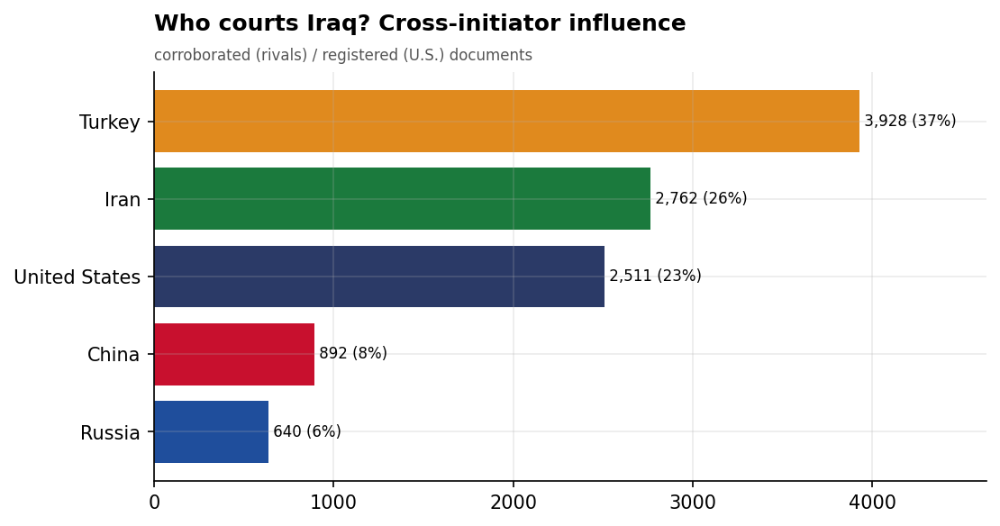
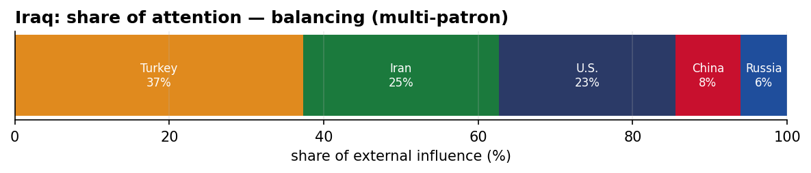
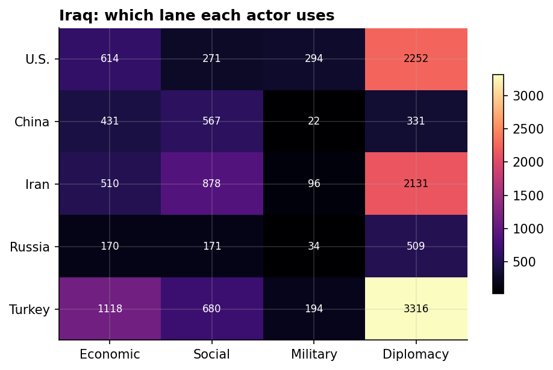
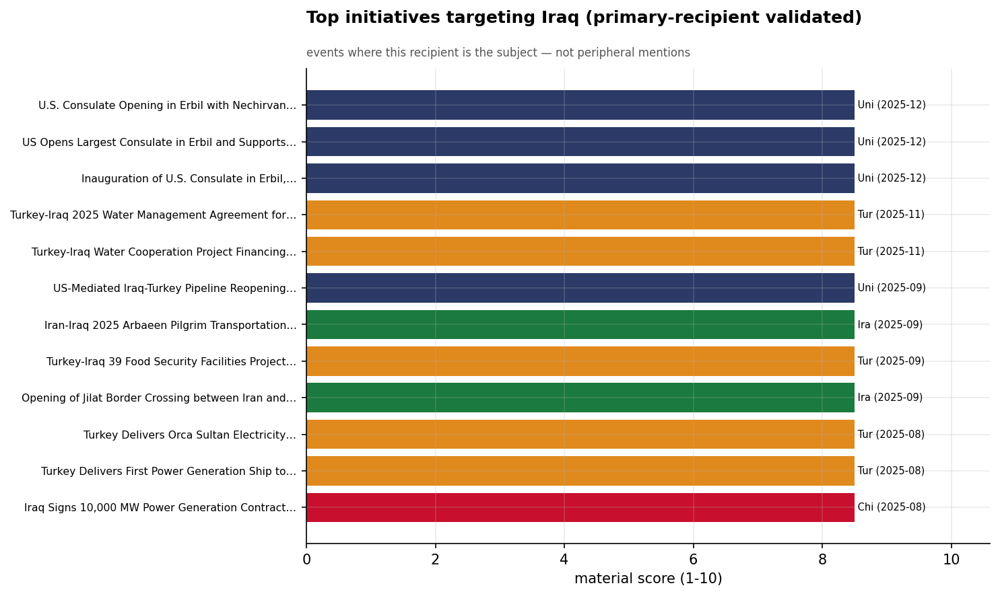
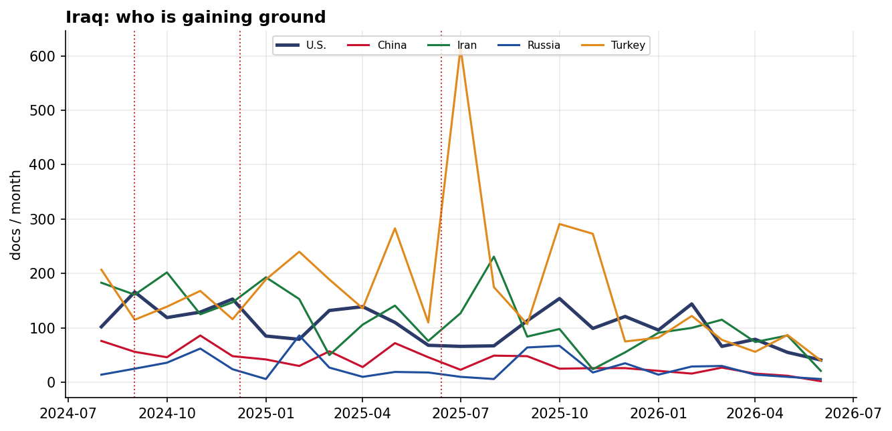

# Who Courts Iraq? A Cross-Initiator Influence Assessment
### China · Iran · Russia · Turkey · United States — for Policy Analysis

*Open-source media corpus, 2024-08-01 to 2026-06-15. Method/caveats per
`../../INSIGHT_REPORT_PROMPT.md`. Intensity = third-party-corroborated documents (U.S. = registered
coverage; the U.S. has no state media in the corpus). Confidence: **(H)/(M)/(L)**.*

> **Hedging profile: balancing (multi-patron).** Lead actor: **Turkey** (37% of external attention).

---

## 1. Key Findings (BLUF)

- **Iraq balances multiple patrons** — Turkey leads (37%) but engages Iran, U.S. substantially too. **(M)**
- **Division of labor by instrument:** Economic→**Turkey**, Social→**Iran**, Military→**U.S.**, Diplomacy→**Turkey**. **(H)**
- **Turkey is the across-the-board lead** — economics, social, and diplomacy — the reconstruction-patron model. **(M)**
- **Signature initiative:** U.S. Consulate Opening in Erbil with Nechirvan Barzani, December 2025 (U.S.). **(M)**

---

## 2. The Suitors

| Actor | Influence (docs) | Share |
|-------|-----------------:|------:|
| Turkey | 3,893 | 37% |
| Iran | 2,643 | 25% |
| U.S. | 2,383 | 23% |
| China | 878 | 8% |
| Russia | 630 | 6% |

Iraq's external-influence field is **balancing (multi-patron)**. **Turkey is the across-the-board lead** — economics, social, and diplomacy — the reconstruction-patron model.

---

## 3. Instrument Matrix — Which Lane Each Actor Uses

Read by instrument, the competition for Iraq sorts cleanly: **Economic → Turkey**,
**Social → Iran**, **Military → U.S.**, **Diplomacy →
Turkey**. Each actor competes in the lane that fits its regional model rather
than going head-to-head across all four. **(H)**

---

## 4. Initiatives Targeting Iraq

*Validated for alignment: only events where Iraq is the **primary** recipient are shown — named in
the title, holding ≥40% of the event's recipient mentions, or the sole top recipient.
19 peripheral events (where Iraq was only mentioned in
passing on another country's initiative — e.g., regional spillover) were excluded.*

- **U.S. Consulate Opening in Erbil with Nechirvan Barzani, December 2025** — U.S., material 8.50 (2025-12)
- **US Opens Largest Consulate in Erbil and Supports Iraq's Energy Independence** — U.S., material 8.50 (2025-12)
- **Inauguration of U.S. Consulate in Erbil, Kurdistan, December 2025** — U.S., material 8.50 (2025-12)
- **Turkey-Iraq 2025 Water Management Agreement for Drought Mitigation** — Turkey, material 8.50 (2025-11)
- **Turkey-Iraq Water Cooperation Project Financing Agreement Signing, Nov 2025** — Turkey, material 8.50 (2025-11)
- **US-Mediated Iraq-Turkey Pipeline Reopening Agreement, September 2025** — U.S., material 8.50 (2025-09)
- **Iran-Iraq 2025 Arbaeen Pilgrim Transportation Infrastructure Upgrade** — Iran, material 8.50 (2025-09)
- **Turkey-Iraq 39 Food Security Facilities Project Launch, September 2025** — Turkey, material 8.50 (2025-09)

---

## 5. Contested Dynamics, Trajectory & Gaps

- **Trajectory:** see the monthly series for who is gaining or losing ground in Iraq; activity tracks
  the region's inflection points (Israel-Hezbollah escalation Sept 2024, Assad's fall Dec 2024, the
  June 2025 Israel-Iran war). **(M)**
- **Adversarial framing:** 11.4% of the U.S.'s coverage in Iraq is carried by Iranian media — its image here is partly written by its adversary. **(M)**
- **Caveat:** this measures *reported* influence; the soft-power lens under-captures hard power, and
  dollar figures are announced, not verified. 

---

*Visuals plot corroborated/registered influence; underlying numbers in sibling CSVs under `assets/`.
Index: [`../README.md`](../README.md). Method: `docs/INSIGHT_REPORT_PROMPT.md`.*
