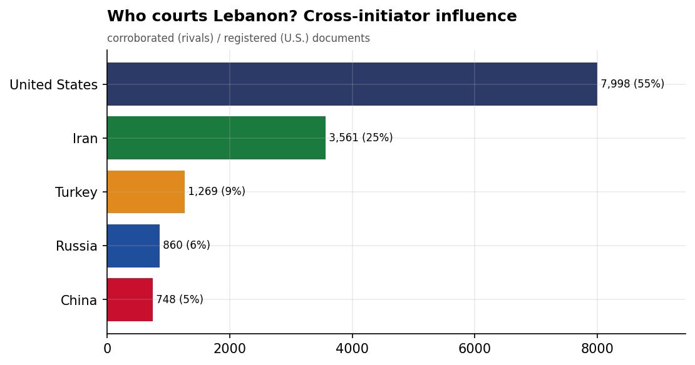
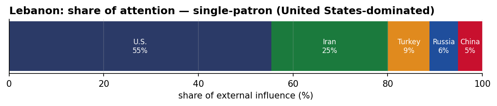
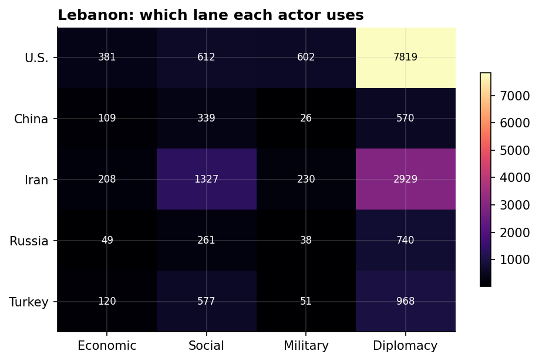
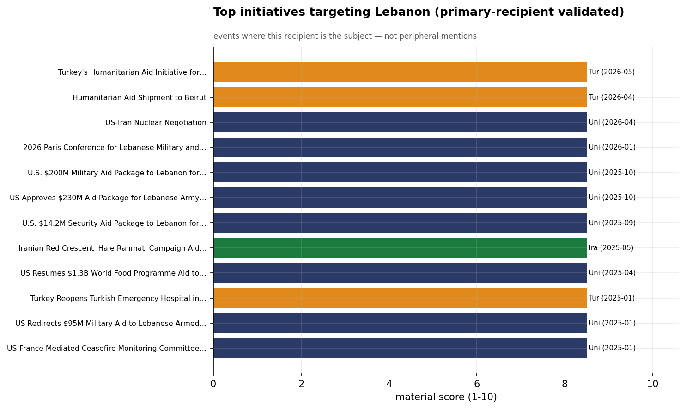
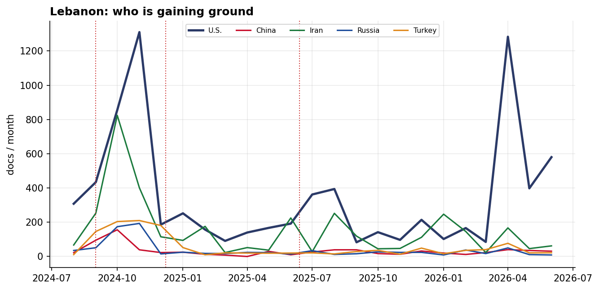

# Who Courts Lebanon? A Cross-Initiator Influence Assessment
### China · Iran · Russia · Turkey · United States — for U.S. Decision-Makers

*Open-source media corpus, 2024-08-01 to 2026-06-15. Method/caveats per
`../../INTEL_REPORT_PROMPT.md`. Intensity = third-party-corroborated documents (U.S. = registered
coverage; the U.S. has no state media in the corpus). Confidence: **(H)/(M)/(L)**.*

> **Hedging profile: single-patron (United States-dominated).** Lead actor: **U.S.** (55% of external attention).

---

## 1. Key Judgments (BLUF)

- **Lebanon is dominated by U.S. involvement (55% of external attention)** — but this reflects Lebanon's centrality to a crisis/alliance file, not development courtship. **(H)**
- **Division of labor by instrument:** Economic→**U.S.**, Social→**Iran**, Military→**U.S.**, Diplomacy→**U.S.**. **(H)**
- The U.S. lead here is **crisis/alliance involvement, not economic courtship** — it reflects how central Washington is to this file, adversarially or as guarantor. **(M)**
- **Signature initiative:** Turkey's Humanitarian Aid Initiative for Displaced Lebanese (Turkey). **(M)**

---

## 2. The Suitors

| Actor | Influence (docs) | Share |
|-------|-----------------:|------:|
| U.S. | 7,998 | 55% |
| Iran | 3,561 | 25% |
| Turkey | 1,269 | 9% |
| Russia | 860 | 6% |
| China | 748 | 5% |

Lebanon's external-influence field is **single-patron (United States-dominated)**. The U.S. lead here is **crisis/alliance involvement, not economic courtship** — it reflects how central Washington is to this file, adversarially or as guarantor.

---

## 3. Instrument Matrix — Which Lane Each Actor Uses

Read by instrument, the competition for Lebanon sorts cleanly: **Economic → U.S.**,
**Social → Iran**, **Military → U.S.**, **Diplomacy →
U.S.**. Each actor competes in the lane that fits its regional model rather
than going head-to-head across all four. **(H)**

---

## 4. Initiatives Targeting Lebanon

*Validated for alignment: only events where Lebanon is the **primary** recipient are shown — named in
the title, holding ≥40% of the event's recipient mentions, or the sole top recipient.
55 peripheral events (where Lebanon was only mentioned in
passing on another country's initiative — e.g., regional spillover) were excluded.*

- **Turkey's Humanitarian Aid Initiative for Displaced Lebanese** — Turkey, material 8.50 (2026-05)
- **Humanitarian Aid Shipment to Beirut** — Turkey, material 8.50 (2026-04)
- **US-Iran Nuclear Negotiation** — U.S., material 8.50 (2026-04)
- **2026 Paris Conference for Lebanese Military and Security Support** — U.S., material 8.50 (2026-01)
- **U.S. $200M Military Aid Package to Lebanon for Hezbollah Disarmament, October 2025** — U.S., material 8.50 (2025-10)
- **US Approves $230M Aid Package for Lebanese Army to Implement UNSC Resolution 1701** — U.S., material 8.50 (2025-10)
- **U.S. $14.2M Security Aid Package to Lebanon for Army Support, September 2025** — U.S., material 8.50 (2025-09)
- **Iranian Red Crescent 'Hale Rahmat' Campaign Aid Delivery to Lebanon, May 2025** — Iran, material 8.50 (2025-05)

---

## 5. Contested Dynamics, Trajectory & Gaps

- **Trajectory:** see the monthly series for who is gaining or losing ground in Lebanon; activity tracks
  the region's inflection points (Israel-Hezbollah escalation Sept 2024, Assad's fall Dec 2024, the
  June 2025 Israel-Iran war). **(M)**

- **Caveat:** this measures *reported* influence; the soft-power lens under-captures hard power, and
  dollar figures are announced, not verified. For Lebanon, a high U.S. share reflects crisis/alliance involvement rather than economic courtship.

---

*Visuals plot corroborated/registered influence; underlying numbers in sibling CSVs under `assets/`.
Index: [`../README.md`](../README.md). Method: `docs/INTEL_REPORT_PROMPT.md`.*
