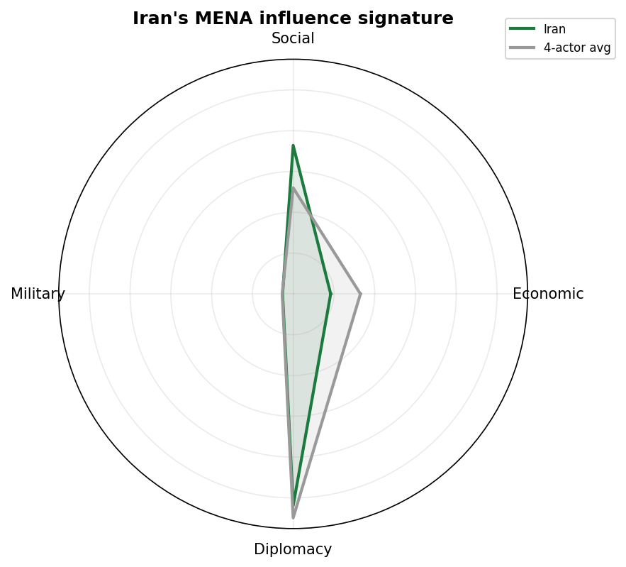
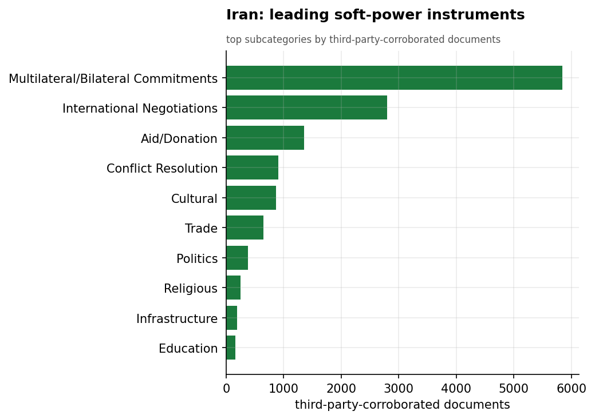
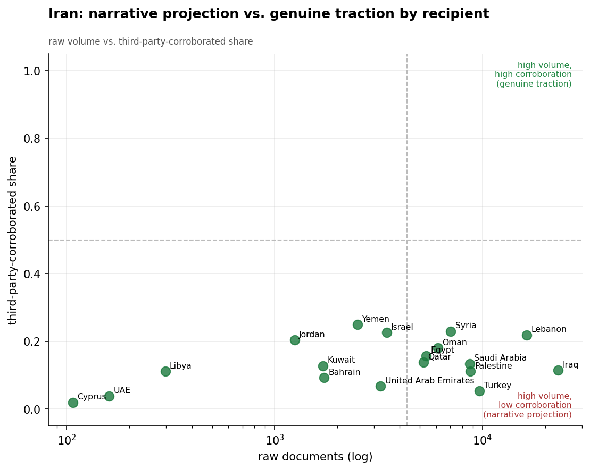
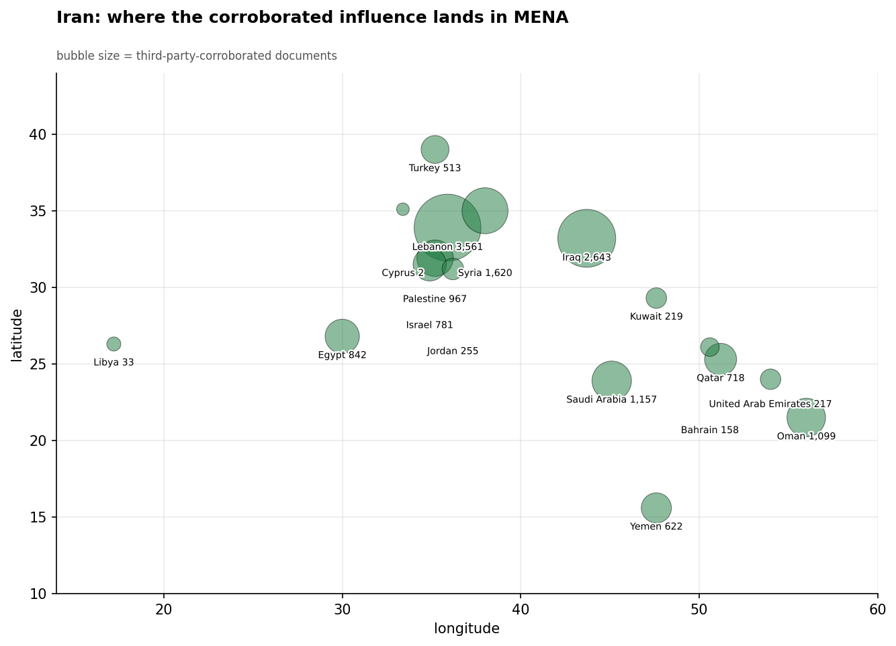
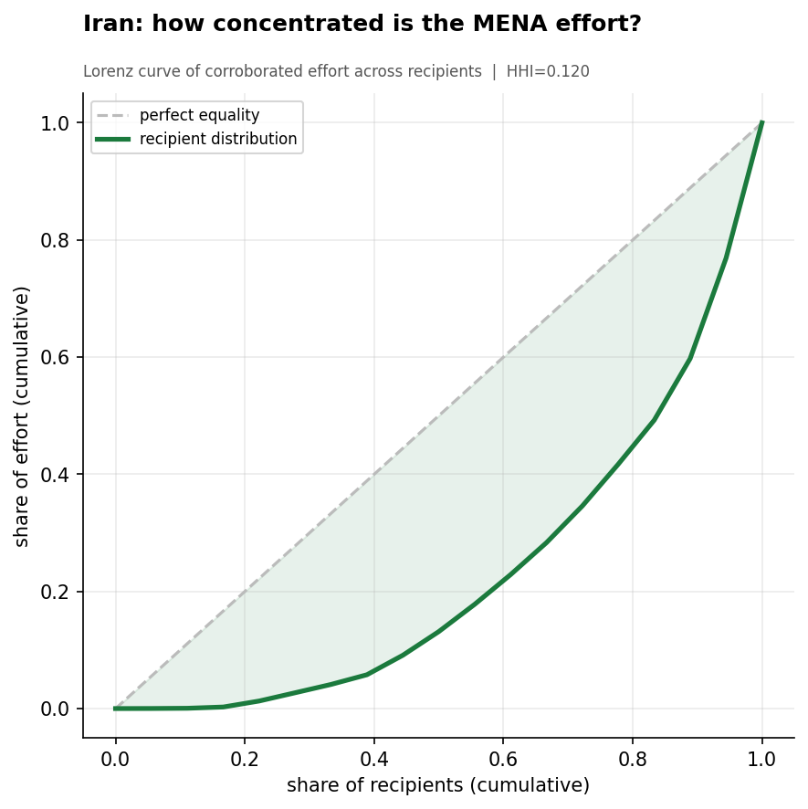
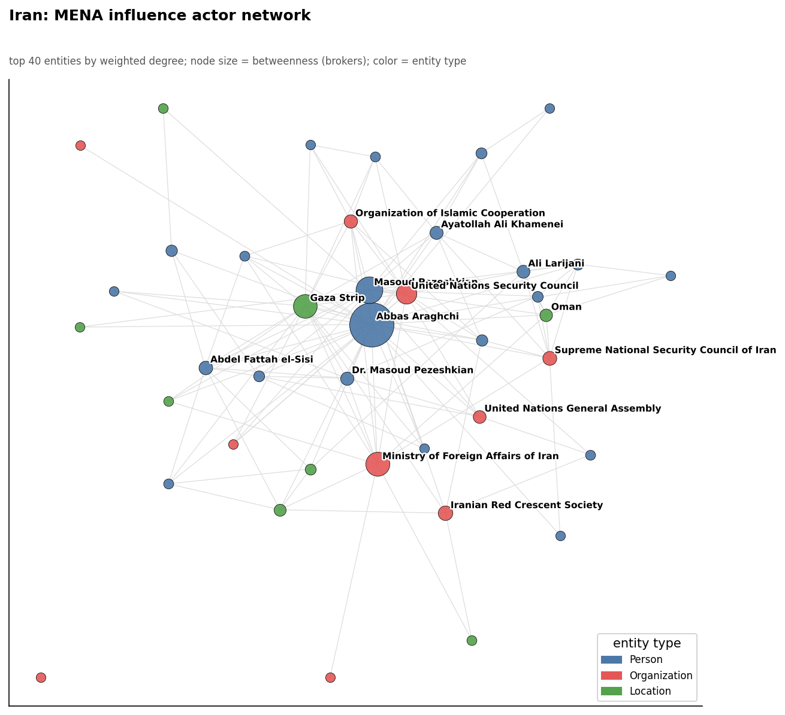
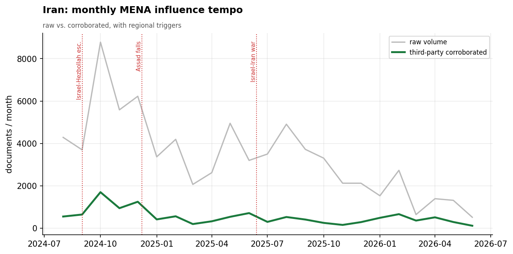

# Iran's Soft-Power Influence in the Middle East & North Africa
### A Strategic Influence Assessment for U.S. Decision-Makers

*Observation window: 2024-08-01 to 2026-06-15 (open-source media corpus). Prepared from the
Soft Power Analytics database; method, scope, and caveats per `docs/INTEL_REPORT_PROMPT.md`.
Intensity is measured in **third-party-corroborated** documents (coverage not originating from
Iranian state media) unless noted. Confidence tags: **(H)** high, **(M)** moderate, **(L)** low.*

---

## 1. Key Judgments (BLUF)

- **Iran's apparent dominance of MENA influence is largely a media artifact.** Iran posts the
  largest *raw* footprint of any actor (76,792 documents) but **84% of it originates from
  Iranian state media** (IRIB, Fars, Mehr, IRNA, Tasnim). On third-party-corroborated volume
  Iran ranks **last of the four** assessed actors — 12,223 docs, versus Turkey's 34,927,
  Russia's 24,800, and China's 24,792. **(H)**
- **Iran's genuine regional traction is concentrated in the Shia "Axis of Resistance"
  geography** — Lebanon (3,561 corroborated docs), Iraq (2,643), and Syria (1,620). Outside
  this arc its independently-reported footprint thins sharply. **(H)**
- **Iran's distinctive instrument is religious-social soft power**, not economics. Its
  highest-materiality non-strategic events are *Arbaeen pilgrimage* infrastructure projects —
  upgraded transport, and the opening of the Jilat and Khosravi border crossings to move Shia
  pilgrims into Iraq — paired with humanitarian work through the **Iranian Red Crescent
  Society**. Economic activity is just 9.2% of its profile. **(H)**
- **The Iran-China 25-Year Strategic Cooperation Agreement is Iran's single highest-impact
  influence event** in-window, underscoring that Iran's most consequential moves are about
  securing *external* great-power alignment (China, Russia) to offset isolation. **(M)**
- **Iran's network is intensely personalized around its diplomats** — Foreign Minister **Abbas
  Araghchi** is by far the dominant node (3,545 documents), with President **Pezeshkian**, the
  **Supreme National Security Council** (Ali Larijani), and Hezbollah's **Hassan Nasrallah**
  forming the core. **(H)**
- **Iran loses the head-to-head contest in most of MENA.** It leads only in Lebanon; it trails
  Russia inside its own partnership space, Turkey across the Levant, and China across the Gulf
  and Egypt. **(M)**

---

## 2. Strategic Posture

Iran's MENA influence strategy is one of **ideological and confessional projection backed by a
state-media megaphone**. Its theory of influence is to sustain the "Axis of Resistance" — a
network of aligned states and non-state actors bound by Shia religious solidarity and
opposition to Israel and the West — and to amplify that alignment through a dense domestic
press ecosystem (82 distinct Iran-geofocus outlets in the corpus).

That megaphone is the central analytic fact about Iran: it makes Iran *look* like the region's
dominant influence actor while its externally-validated footprint is the smallest of the four.
The 84% self-report share is not merely noise to be filtered — it is itself the finding. Iran
practices **narrative projection** at a scale none of the other actors approach, but the world
beyond Iranian media corroborates only a fraction of it.

---

## 3. Categorical Breakdown

**Diplomacy (51.9%).** Dominated by *Multilateral/Bilateral Commitments* (5,842 corroborated
docs), *International Negotiations* (2,795), and *Conflict Resolution* (907). Much of this is
Iran positioning on Gaza and managing its nuclear-diplomacy posture; FM Araghchi co-occurs most
with the "Gaza Strip" and the UN Security Council. **(H)**

**Social (36.4%) — Iran's signature differentiator.** No other assessed actor leans this
heavily on social/religious soft power. The instruments are **religious pilgrimage logistics**
(the Arbaeen infrastructure and border-crossing projects into Iraq) and **humanitarian aid**
via the Iranian Red Crescent Society. This is confessional statecraft: moving millions of Shia
pilgrims and delivering aid as a vehicle of regional solidarity. **(H)**

**Economic (9.2%) — a structural weakness.** Under sanctions, Iran cannot compete on the
economic terrain China and Russia occupy. Its notable economic events (Ardabil Expo 2025) are
modest, and its biggest economic move is the *strategic* China agreement rather than a
standalone commercial deal. **(H)**

**Military (2.6%).** The corpus captures little of Iran's hard-power/proxy activity by design
(the lens is influence, not kinetics); the visible military-category items are defense
diplomacy. Note that Hezbollah's Nasrallah appears as a top *entity* even though military
*category* volume is low — Iran's security influence operates through actors more than through
reported "soft" military events. **(M)**

---

## 4. Recipient Matrix

Ranked by third-party-corroborated intensity, Iran's credible reach is strikingly narrow and
confessional:

| Tier | Recipients (corroborated docs) | Read |
|------|-------------------------------|------|
| **Lead** | Lebanon (3,561), Iraq (2,643) | The Hezbollah and Iraqi-Shia cores of the Resistance Axis |
| **Strong** | Syria (1,620), Saudi Arabia (1,157), Oman (1,099) | Syria (legacy ally); Saudi/Oman reflect détente diplomacy |
| **Moderate** | Palestine (967), Egypt (842), Israel (781) | Issue-driven (Gaza), not relationship depth |
| **Thin** | Jordan, Bahrain, Gulf states | Marginal credible presence |

- **Lebanon is Iran's one clear stronghold** — the Hezbollah relationship is the densest
  externally-corroborated Iran tie in MENA. **(H)**
- **Iraq is the Arbaeen corridor** — Iran's credible Iraq footprint is built on religious
  pilgrimage logistics and border infrastructure, a soft-power instrument unique to Iran. **(H)**
- **Note the low corroboration shares (0.11–0.23 across recipients):** even where Iran is
  active, most coverage is Iranian state media. Iran's *self-narrated* reach vastly exceeds its
  *externally-validated* reach in every recipient. **(H)**

---

## 5. Actor & Network Analysis

Iran's influence network is the most **personality-driven** of the four. Foreign Minister
**Abbas Araghchi** is the overwhelming hub — the broker connecting Iran's diplomacy to the UN
Security Council, to counterparts (Egypt's Badr Abdel-Aty), and to the Gaza file. Around him
sit President **Masoud Pezeshkian**, the **Supreme National Security Council** under **Ali
Larijani**, the **Iranian Red Crescent Society** (the humanitarian arm), and — significantly —
Hezbollah's **Hassan Nasrallah**, whose presence as a top entity ties Iran's "soft" influence
network directly to its armed proxy network. The structure is a hub-and-spoke around the
foreign-policy elite, not the distributed institutional web seen with China or the
multi-patron coalitions seen with Turkey. **(H)**

---

## 6. Temporal Dynamics

The gap between Iran's raw and corroborated lines is the widest of any actor — a permanent
visual reminder of the state-media inflation. Corroborated activity is event-sensitive,
rising around Gaza-conflict diplomacy and the annual **Arbaeen pilgrimage season** (late
summer), when border-crossing and pilgrim-transport activity peaks. Iran's tempo tracks the
religious calendar and the Israel-Iran confrontation more than any economic cycle. **(M)**

---

## 7. Intelligence Gaps & Collection Priorities

- **The state-media inflation is the headline caveat.** Any assessment of Iran that uses raw
  volume will overstate its reach by roughly 6-to-1. Always normalize Iran against third-party
  corroboration; treat Iranian-media-only claims as *intent/projection*, not confirmed traction.
- **Proxy and IRGC activity is under-captured.** The soft-power lens misses most of Iran's
  hard-power influence (Hezbollah, Iraqi militias, the Houthis). Nasrallah's prominence as an
  entity is a hint of a much larger security network outside this dataset. **Collection
  priority:** pair this corpus with proxy-network and IRGC-Quds Force reporting.
- **Religious soft power deserves dedicated tracking.** The Arbaeen pilgrimage and Red Crescent
  channels are Iran's most distinctive and externally-corroborated instruments and are
  under-analyzed relative to nuclear/proxy files.
- **External-alignment dependency.** Iran's highest-impact events are agreements with China and
  Russia — its influence increasingly *borrows* great-power weight. Monitor the durability of
  the China 25-year pact and Russia-Iran partnership as leading indicators of Iran's regional
  staying power.

---

*Visuals plot third-party-corroborated metrics (raw shown alongside for the provenance
contrast); underlying numbers persisted as sibling CSVs under `assets/`. Derived analytics
documented in `docs/reports/_derived/manifest.md`.*
